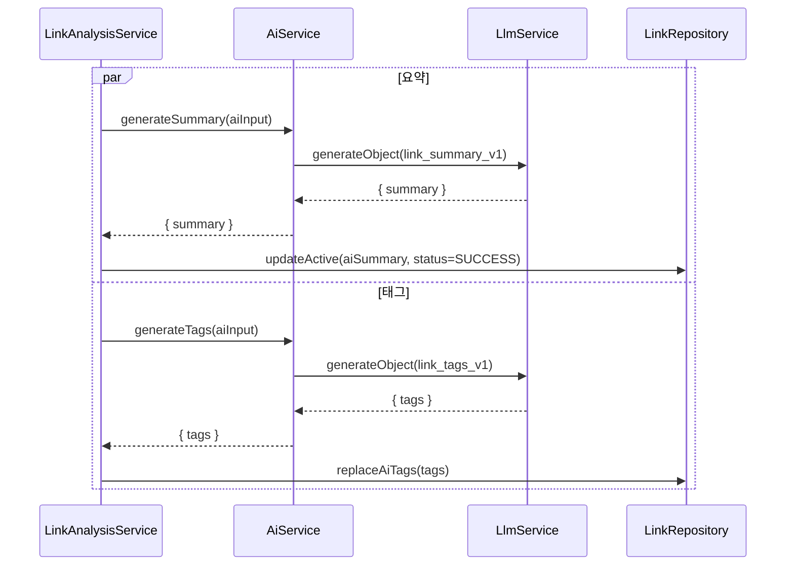
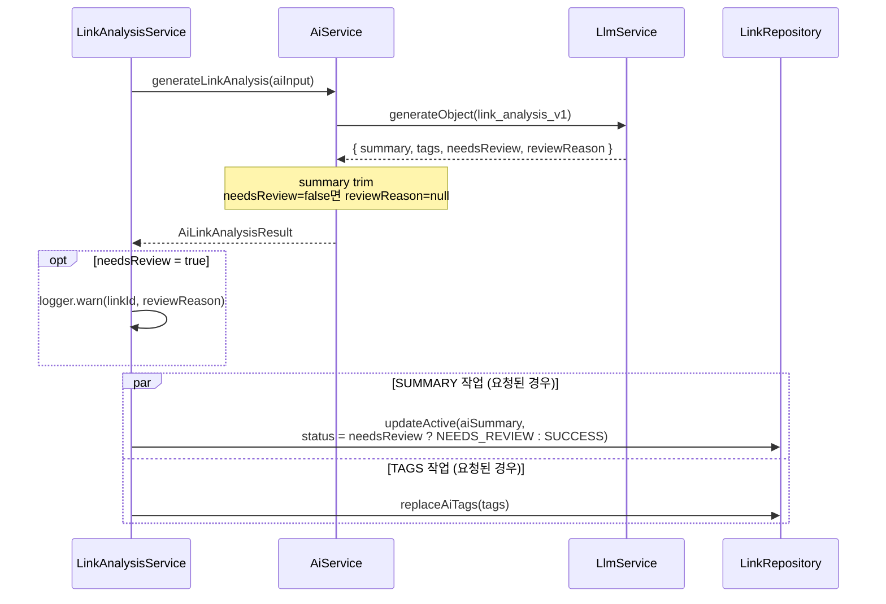
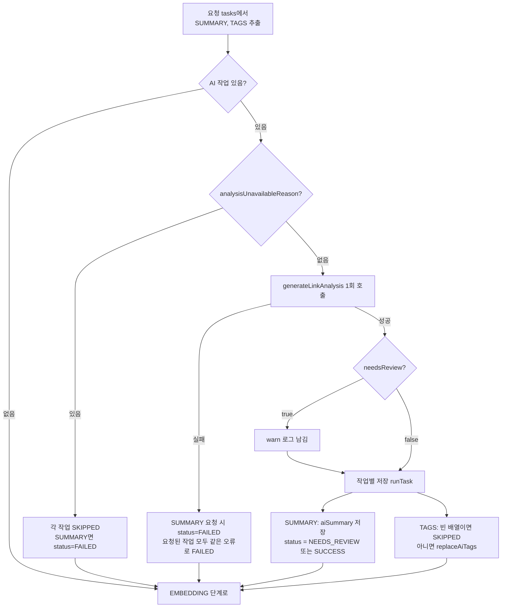
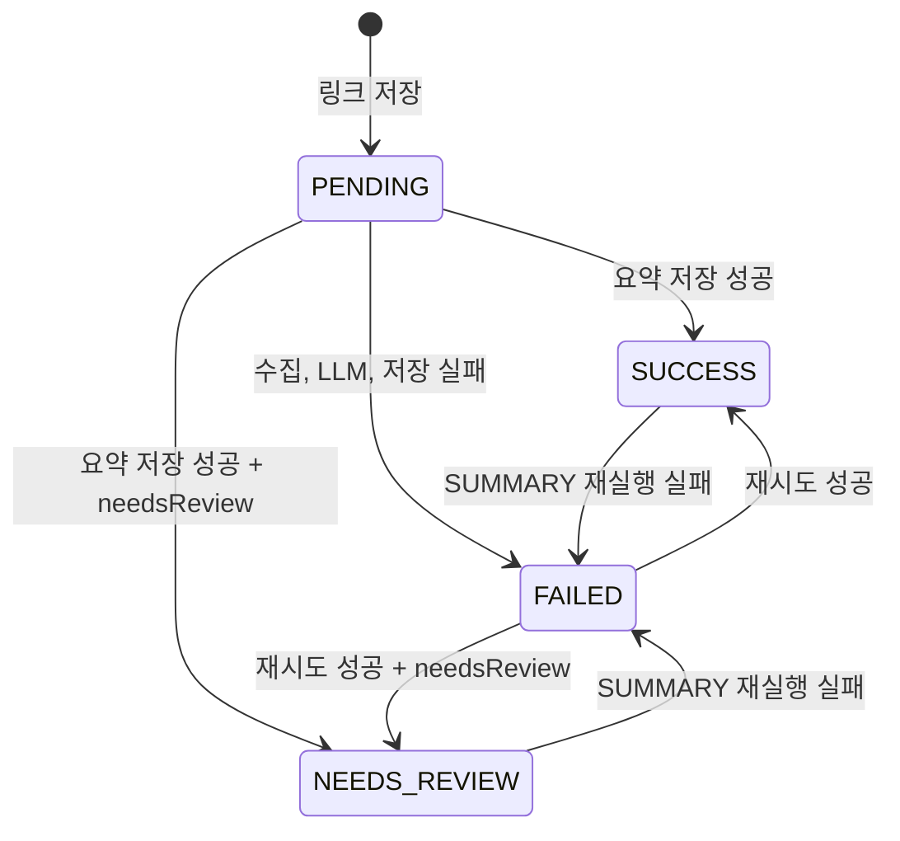
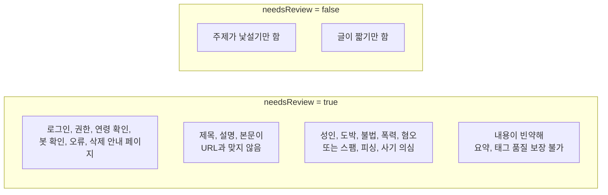
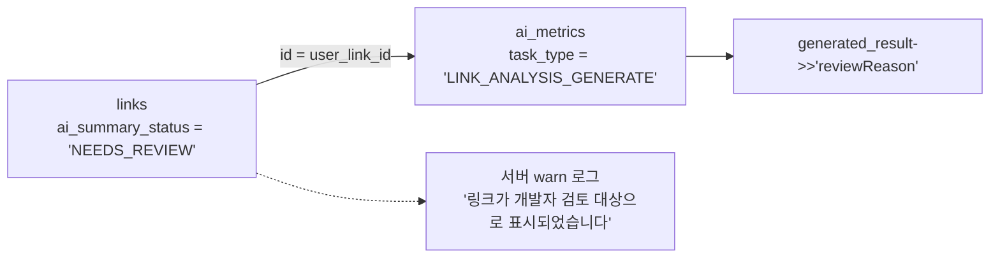

# 링크 분석 단일 호출 전환과 NEEDS_REVIEW 상태

요약과 태그를 따로 생성하던 LLM 호출을 한 번으로 합치고, AI가 링크 내용에 이상을 감지하면
`ai_summary_status`를 `NEEDS_REVIEW`로 남기도록 바꾼 변경을 정리한다.

<br>

## 한눈에 보기

| 항목 | 변경 전 | 변경 후 |
| --- | --- | --- |
| LLM 호출 수 (링크 1건) | 2회 (`generateSummary`, `generateTags`) | 1회 (`generateLinkAnalysis`) |
| 프롬프트 | `link_summary_v1`, `link_tags_v1` | `link_analysis_v1` |
| 메트릭 task type | `SUMMARY_GENERATE`, `TAG_GENERATE` | `LINK_ANALYSIS_GENERATE` |
| structured output | `{ summary }`, `{ tags }` | `{ summary, tags, needsReview, reviewReason }` |
| `ai_summary_status` 값 | `PENDING`, `SUCCESS`, `FAILED` | `NEEDS_REVIEW` 실제 사용 시작 |
| SQS 재시도 작업 단위 | `SUMMARY`, `TAGS` | 변경 없음 |

<br>

## LLM 호출 흐름

### 변경 전



### 변경 후



<br>

## 작업 실행과 실패 처리

`run()` 안에서 AI 작업이 어떻게 결정되고 저장되는지의 흐름이다. LLM 호출은 한 번이지만
저장은 작업별로 나눠서 한쪽 DB 오류가 다른 쪽 결과를 막지 않는다.



- `SUMMARY`만 재시도하든 `TAGS`만 재시도하든 LLM 호출은 1회이고, 요청된 작업만 저장한다.
- `TAGS`만 재시도할 때는 기존 요약 상태를 건드리지 않는다.
- `NEEDS_REVIEW`는 작업 결과로는 `SUCCESS`이므로 재시도 대상이 아니고, `EMBEDDING`도 정상 진행된다.

<br>

## ai_summary_status 상태 전이



`NEEDS_REVIEW`는 개발자만 확인하는 상태다. API 응답의 `processingStatus`는 이 값을 `SUCCESS`로 변환해
내려주므로 클라이언트에는 노출되지 않는다 (`link.util.ts`의 `toProcessingStatus`). 판정 사유도 API로 내려주지 않는다.

<br>

## needsReview 판정 기준

프롬프트 `link_analysis_v1`의 `[needsReview / reviewReason]` 블록에 정의한 기준이다.



- `needsReview`가 `true`여도 `summary`와 `tags`는 입력에서 확인 가능한 범위에서 생성한다.
- `reviewReason`은 `true`일 때만 한국어 한 문장, 200자 이내로 쓰고 `false`이면 `null`이다.

<br>

## 검토 대상 링크 확인 방법



```sql
SELECT l.id, l.original_url, m.generated_result->>'reviewReason' AS review_reason
FROM links l
JOIN ai_metrics m ON m.user_link_id = l.id
WHERE l.ai_summary_status = 'NEEDS_REVIEW'
  AND m.task_type = 'LINK_ANALYSIS_GENERATE'
  AND m.status = 'SUCCESS'
ORDER BY m.created_at DESC;
```

<br>

## 변경 파일

| 경로 | 변경 |
| --- | --- |
| `src/modules/ai/ai.constants.ts` | task type을 `LINK_ANALYSIS_GENERATE` 하나로 통합, `reviewReasonMaxLength` 추가 |
| `src/modules/ai/ai-link-analysis.schema.ts` | `aiLinkAnalysisResultSchema` 단일 스키마 |
| `src/modules/ai/ai-link-analysis.prompt.ts` | 요약, 태그, 검토 규칙을 합친 `link_analysis_v1` |
| `src/modules/ai/ai.type.ts` | `AiLinkAnalysisResult` 타입 |
| `src/modules/ai/ai.service.ts` | `generateLinkAnalysis`로 통합, 결과 정리 |
| `src/modules/link/analysis/link-analysis.service.ts` | `runAiAnalysis`에서 1회 호출 후 `saveSummary`, `saveTags`로 분리 저장 |
| `src/modules/link/analysis/link-analysis.type.ts` | `LinkAnalysisAiTask` 타입 |
| `src/modules/link/link.util.ts`, `link.service.ts` | `toProcessingStatus`로 응답에서 `NEEDS_REVIEW`를 `SUCCESS`로 변환 |
| `src/modules/link/link.schema.ts`, `dto/link.response.dto.ts` | `NEEDS_REVIEW` 의미 주석, 응답 enum에서 제외 |
| `docs/ai/*`, `docs/api/link.md`, `docs/database/tables/*` | 문서 갱신 |
