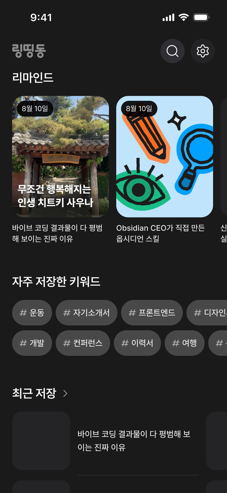

# API 명세서 — 추천 (Recommendation)

## 자주 저장한 키워드 조회

홈 화면의 `자주 저장한 키워드` 섹션에 사용할 폴더·태그 추천을 조회한다.



```http
GET /recommendations?limit=12
Authorization: Bearer {accessToken}
```

사용자의 활성 링크를 기준으로 링크가 많이 저장된 폴더와 태그를 하나의 flat 목록으로 반환한다. 홈 화면에서는 query를 생략해 기본값인 최대 12개를 사용한다.

| Query   | 타입   | 기본값 | 설명                         |
| ------- | ------ | ------ | ---------------------------- |
| `limit` | number | `12`   | 반환 개수. 최소 1, 최대 50개 |

정렬 순서는 다음과 같다.

1. 연결된 활성 링크 수 내림차순
2. 링크 수가 같으면 마지막 조회 시각 내림차순 (`null`은 뒤)
3. 그래도 같으면 `type`, `key` 오름차순

```json
{
    "success": true,
    "data": {
        "items": [
            {
                "key": "folder:3",
                "type": "folder",
                "label": "디자인",
                "linkCount": 12,
                "lastViewedAt": "2026-08-08T00:00:00.000Z",
                "folderId": 3,
                "color": "#61a8ef"
            },
            {
                "key": "tag:product-design",
                "type": "tag",
                "label": "Product Design",
                "linkCount": 9,
                "lastViewedAt": null,
                "normalizedTag": "product-design"
            }
        ]
    }
}
```

## 섹션 노출 계약

서버는 `limit`을 적용하기 전 전체 폴더·태그 후보 수를 확인한다.

- 후보가 4개 이상이면 정렬 후 최대 `limit`개를 `data.items`로 반환한다.
- 후보가 3개 이하면 다음과 같이 `data: null`을 반환한다.
- 클라이언트는 `data === null`이면 `자주 저장한 키워드` 제목과 키워드 칩을 포함한 섹션 전체를 렌더링하지 않는다. 빈 컨테이너나 빈 상태 문구도 노출하지 않는다.

```json
{
    "success": true,
    "data": null
}
```

- 폴더 항목에는 `folderId`, `color`가 포함된다.
- 태그 항목에는 `normalizedTag`가 포함된다.
- soft delete된 링크와 삭제된 폴더는 집계에서 제외한다.
- 내부 점수나 가중치는 사용하거나 응답에 노출하지 않는다.
- `type`은 폴더와 태그를 구분하기 위한 값이다. 칩 선택 후 이동·검색 동작은 클라이언트 화면 정책에서 결정한다.
