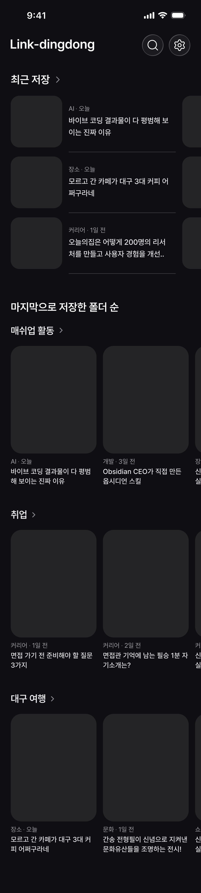
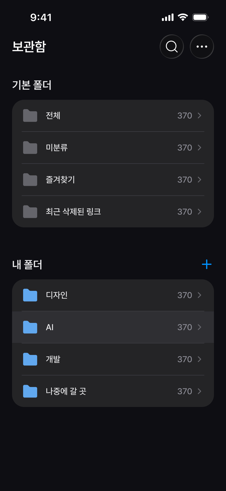
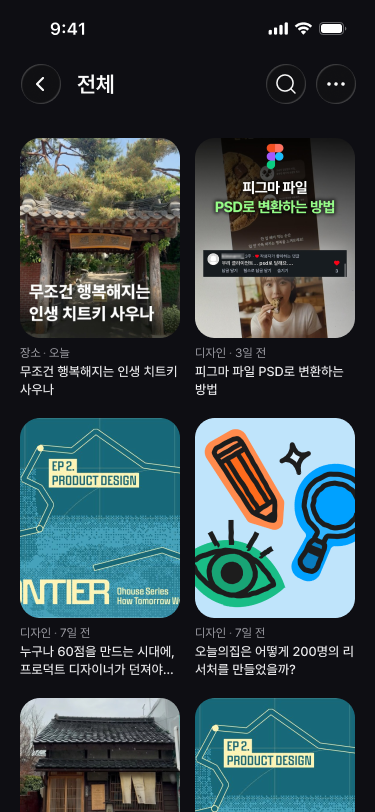
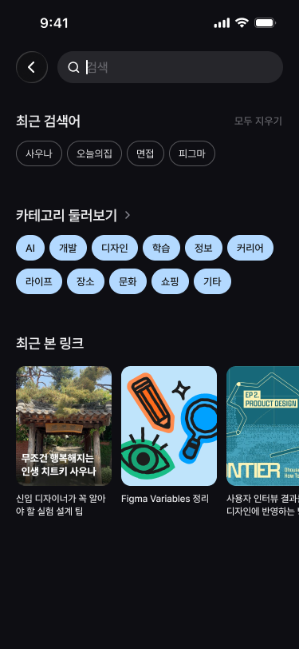
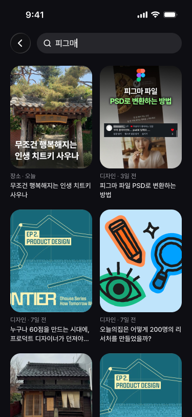
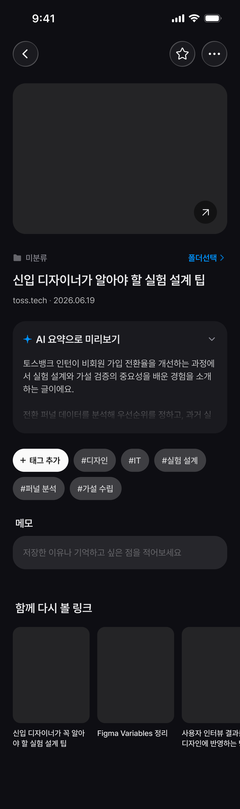
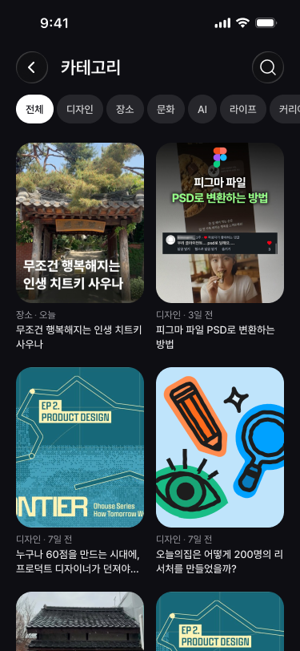

# 화면별 API 조합

> [API 명세 인덱스](./api-spec.md) · 화면 원본은 [`screens`](./screens/) 폴더에서 확인할 수 있습니다.

| 상태 | 의미                                      |
| ---- | ----------------------------------------- |
| O    | 현재 로직까지 연결됨                      |
| △    | Endpoint와 계약은 있으나 일부 TODO가 있음 |
| X    | API 또는 정책 결정이 필요함               |

## 홈

| 화면 영역            | API                                                  | 상태 | 남은 작업                                 |
| -------------------- | ---------------------------------------------------- | :--: | ----------------------------------------- |
| 최근 저장            | `GET /links?sortBy=savedAt&order=desc&limit=9`       |  △   | 정렬·cursor 페이지네이션 연결             |
| 최근 저장한 폴더     | `GET /folders?sortBy=lastSavedAt&order=desc&limit=3` |  △   | `lastSavedAt` 집계·정렬 연결              |
| 폴더별 링크 미리보기 | 현재 정책 결정 필요                                  |  X   | 폴더별 호출 또는 홈 전용 집계 API 중 선택 |

## 보관함과 폴더별 링크

| 화면 영역                    | API                                                   | 상태 | 남은 작업                               |
| ---------------------------- | ----------------------------------------------------- | :--: | --------------------------------------- |
| 링크 상태별 통계·사용자 폴더 | `GET /folders`                                        |  △   | 즐겨찾기 카운트·폴더 정렬 연결          |
| 전체                         | `GET /links`                                          |  △   | cursor 페이지네이션 연결                |
| 미분류                       | `GET /links?unassigned=true`                          |  △   | cursor 페이지네이션 연결                |
| 즐겨찾기                     | `GET /links?favorite=true`                            |  △   | 즐겨찾기 필터·cursor 페이지네이션 연결  |
| 최근 삭제                    | `GET /links?deleted=true&sortBy=deletedAt&order=desc` |  △   | 삭제 시각 정렬·cursor 페이지네이션 연결 |
| 사용자 폴더 상세             | `GET /links?folderId={folderId}`                      |  △   | cursor 페이지네이션 연결                |

전체·미분류·즐겨찾기·최근 삭제는 화면에서는 폴더처럼 표시되지만 DB의 `folders` row가 아닙니다. `folderId`가 없고 폴더 CRUD 대상도 아닙니다. `GET /folders`는 각 링크 상태의 개수만 제공하며, 항목을 눌렀을 때는 위 표처럼 `GET /links` Query를 조합합니다. 최근 삭제는 삭제된 폴더가 아니라 soft delete된 링크 목록입니다.

## 검색

| 화면 영역         | API                                                        | 상태 | 남은 작업                               |
| ----------------- | ---------------------------------------------------------- | :--: | --------------------------------------- |
| 검색 결과         | `GET /links?q={keyword}`                                   |  △   | cursor 페이지네이션 연결                |
| 필터 범위 내 검색 | `GET /links?folderId={folderId}&favorite=true&q={keyword}` |  △   | 즐겨찾기 필터·cursor 페이지네이션 연결  |
| 최근 본 링크      | `GET /links?sortBy=viewedAt&order=desc&limit=9`            |  △   | 조회 시각 정렬·cursor 페이지네이션 연결 |
| 최근 검색어       | 현재 정책 결정 필요                                        |  X   | 기기 로컬 저장 또는 서버 저장 여부 결정 |

## 링크 상세

| 화면 동작              | API                                   | 상태 | 비고                                                  |
| ---------------------- | ------------------------------------- | :--: | ----------------------------------------------------- |
| 상세 정보 조회         | `GET /links/{linkId}`                 |  △   | 발행일·태그·연관 링크 조회 연결 필요                  |
| 화면 노출 시 조회 기록 | `POST /links/{linkId}/view`           |  O   | Request Body 없이 서버 현재 시각을 `viewedAt`에 저장  |
| 즐겨찾기 설정·해제     | `PATCH /links/{linkId}`               |  O   | `{ "isFavorite": true }` 또는 `false`                 |
| 폴더 이동·미분류 이동  | `PATCH /links/{linkId}`               |  O   | `folderId` 지정, 미분류 이동은 `{ "folderId": null }` |
| 사용자 태그 추가       | `POST /links/{linkId}/tags`           |  △   | Endpoint·계약만 존재, 현재 501·DB 저장 TODO           |
| 사용자 태그 삭제       | `DELETE /links/{linkId}/tags/{tagId}` |  △   | Endpoint·계약만 존재, 현재 501·DB 삭제 TODO           |
| 폴더 선택 목록         | `GET /folders`                        |  O   | 전체 사용자 폴더 반환                                 |

폴더를 선택하지 않은 기본 상태는 다음과 같이 표시합니다.

## 카테고리 둘러보기

현재는 API와 데이터 정책이 정해지지 않았습니다. AI 태그를 카테고리로 사용할지, 별도 카테고리 사전을 둘지 결정한 후 목록 Query 또는 전용 카테고리 API를 확정해야 합니다.
