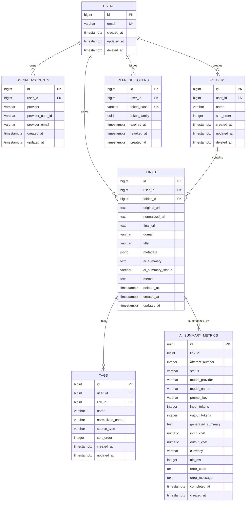

# ERD

커밋된 테이블 설계 문서(`docs/database/tables/`) 기준의 통합 ERD입니다. 초기에는 단순한 **비정규화** 구조로, URL·수집 메타데이터·AI 요약을 `links` 한 테이블에 통합합니다. (설계 문서의 `user_links` 테이블은 코드에서 `links`로 구현)

 

## 전체 ERD

 

## 설계 메모

- URL/제목/이미지/색상 등 메타데이터는 별도 테이블(`link_resources`, `link_snapshots`) 없이 `links`에 통합하고, 확장 정보는 `metadata`(jsonb)에 담는다.
- `ai_summary_metrics`는 실패 기록 보장을 위해 **물리 FK 없이** `link_id`로 논리 참조한다. (ERD의 `AI_SUMMARY_METRICS` 관계선은 논리 참조를 의미)
- 화면에서 폴더처럼 표시되는 전체·미분류·즐겨찾기·최근 삭제는 `folders` 행으로 저장하지 않고 링크 조회 조건으로 표현한다. 최근 삭제는 삭제된 폴더가 아니라 soft delete된 링크 목록이다.
- `tags`는 `(link_id, user_id)` 복합 FK로 `links(id, user_id)`를 참조해 태그·링크의 소유자 정합성을 DB에서 강제한다. 이를 위해 `links`에 `(id, user_id)` 유니크 제약을 둔다. `tags`는 `users`를 직접 참조하지 않고(단독 FK 제거), 소유자·사용자 존재는 `links`를 통해 커버한다.
- `refresh_tokens`는 토큰 원문 대신 해시만 저장하고 RTR(rotation) 방식으로 재사용을 탐지한다. (인증 파이프라인은 후속 작업)
- 세부 컬럼·제약·인덱스는 `docs/database/tables/`의 테이블별 문서를 참조한다.

 

## 미확정 / 다음 단계

- `folders`는 활성(`deleted_at IS NULL`) 폴더 기준 `(user_id, name)` partial unique index로 폴더명 유일성을 DB에서 보장한다. `sort_order`, `deleted_at` 컬럼을 추가했다.
- 기존 `links` 테이블은 위 비정규화 구조로 **교체**했고, `LinkService`/`FolderService`도 새 컬럼에 맞춰 재작성했다.
- 이 스키마는 아직 DB에 적용(`db:generate`/`db:migrate`)하지 않은 초안이다. URL 정규화·메타데이터 수집·AI 요약 파이프라인은 후속 작업이다.
