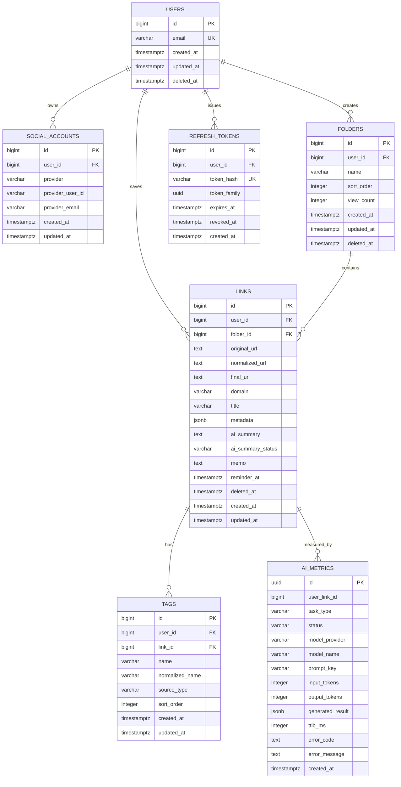

# ERD

커밋된 테이블 설계 문서(`docs/database/tables/`) 기준의 통합 ERD입니다. 초기에는 단순한 **비정규화** 구조로, URL·수집 메타데이터·AI 요약을 `links` 한 테이블에 통합합니다. (설계 문서의 `user_links` 테이블은 코드에서 `links`로 구현)

 

## 전체 ERD

```mermaid
erDiagram
  USERS ||--o{ SOCIAL_ACCOUNTS : owns
  USERS ||--o{ FOLDERS : creates
  USERS ||--o{ LINKS : saves
  USERS ||--o{ REFRESH_TOKENS : issues
  FOLDERS ||--o{ LINKS : contains
  LINKS ||--o{ TAGS : has
  LINKS ||--o{ AI_METRICS : measured_by

  USERS {
    bigint id PK
    varchar email UK
    timestamptz created_at
    timestamptz updated_at
    timestamptz deleted_at
  }

  REFRESH_TOKENS {
    bigint id PK
    bigint user_id FK
    varchar token_hash UK
    uuid token_family
    timestamptz expires_at
    timestamptz revoked_at
    timestamptz created_at
  }

  SOCIAL_ACCOUNTS {
    bigint id PK
    bigint user_id FK
    varchar provider
    varchar provider_user_id
    varchar provider_email
    timestamptz created_at
    timestamptz updated_at
  }

  FOLDERS {
    bigint id PK
    bigint user_id FK
    varchar name
    integer sort_order
    integer view_count
    timestamptz created_at
    timestamptz updated_at
    timestamptz deleted_at
  }

  LINKS {
    bigint id PK
    bigint user_id FK
    bigint folder_id FK
    text original_url
    text normalized_url
    text final_url
    varchar domain
    varchar title
    jsonb metadata
    text ai_summary
    varchar ai_summary_status
    text memo
    timestamptz reminder_at
    timestamptz deleted_at
    timestamptz created_at
    timestamptz updated_at
  }

  TAGS {
    bigint id PK
    bigint user_id FK
    bigint link_id FK
    varchar name
    varchar normalized_name
    varchar source_type
    integer sort_order
    timestamptz created_at
    timestamptz updated_at
  }

  AI_METRICS {
    uuid id PK
    bigint user_link_id
    varchar task_type
    varchar status
    varchar model_provider
    varchar model_name
    varchar prompt_key
    integer input_tokens
    integer output_tokens
    jsonb generated_result
    integer ttlb_ms
    text error_code
    text error_message
    timestamptz created_at
  }
```

 

## 설계 메모

- URL/제목/이미지/색상 등 메타데이터는 별도 테이블(`link_resources`, `link_snapshots`) 없이 `links`에 통합하고, 확장 정보는 `metadata`(jsonb)에 담는다.
- `ai_metrics`는 LLM 호출 성공·실패를 append-only로 기록하며, **물리 FK 없이** `user_link_id`로 `links.id`를 논리 참조한다.
- 화면에서 폴더처럼 표시되는 전체·미분류·즐겨찾기·최근 삭제는 `folders` 행으로 저장하지 않고 링크 조회 조건으로 표현한다. 최근 삭제는 삭제된 폴더가 아니라 soft delete된 링크 목록이다.
- `tags`는 `(link_id, user_id)` 복합 FK로 `links(id, user_id)`를 참조해 태그·링크의 소유자 정합성을 DB에서 강제한다. 이를 위해 `links`에 `(id, user_id)` 유니크 제약을 둔다. `tags`는 `users`를 직접 참조하지 않고(단독 FK 제거), 소유자·사용자 존재는 `links`를 통해 커버한다.
- `refresh_tokens`는 토큰 원문 대신 해시만 저장하고 RTR(rotation) 방식으로 재사용을 탐지한다.
- 세부 컬럼·제약·인덱스는 `docs/database/tables/`의 테이블별 문서를 참조한다.

 

## 비동기 처리

- 링크 저장 후 현재 프로세스에서 메타데이터·대표 이미지 수집, 이미지 색상 추출, AI 요약·태그·임베딩 생성을 비동기로 실행한다. 큐와 재시도 정책은 후속 작업이다.
- 이미지 색상은 선택적 보강 정보로 처리한다. 추출 실패 시 이미지 URL은 보존하며, 요약·태그·임베딩의 전체 성공 상태에는 영향을 주지 않는다.
