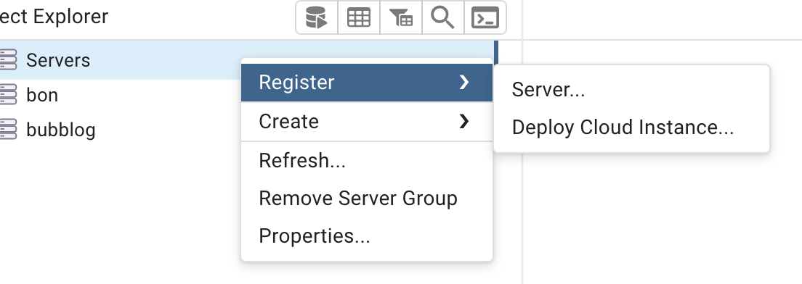
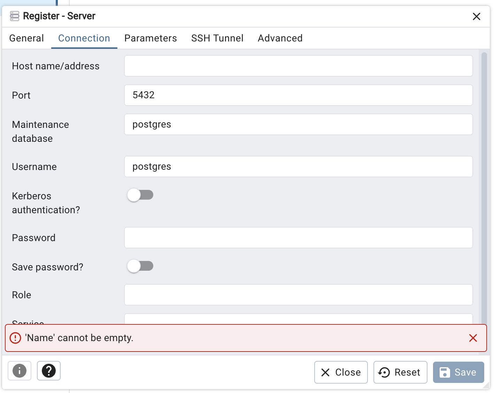
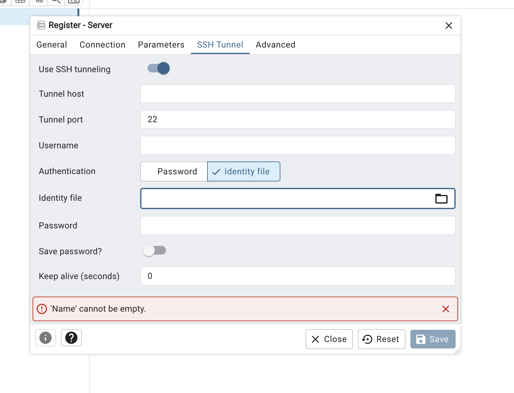

# pgAdmin SSH Tunnel

운영 PostgreSQL은 public port를 열지 않는다. pgAdmin에서는 Lightsail SSH 터널과 DB
인증을 함께 사용해 `promise9` database에 접속한다. 이 문서는 pgAdmin Desktop과 팀에서
안전하게 전달받은 Lightsail PEM 키를 기준으로 한다.

## 먼저 알아둘 것

접속에는 서로 다른 두 인증정보가 필요하다.

| 인증정보            | 용도                        |
| ------------------- | --------------------------- |
| Lightsail PEM 키    | 운영 서버에 SSH로 접속      |
| PostgreSQL 비밀번호 | `promise9` DB 사용자로 인증 |

PEM 키는 PostgreSQL 비밀번호를 대신하지 않는다. 두 인증정보 모두 repository나 문서에
기록하지 않고 팀의 보안 채널을 통해 전달받는다.

```text
pgAdmin
  -> 로컬 OpenSSH 터널
  -> PEM 키로 Lightsail SSH 접속
  -> Lightsail 내부의 127.0.0.1:5432
  -> PostgreSQL promise9
```

SSH host key를 `known_hosts`로 검증할 수 있는
[방법 A](#방법-a-로컬-openssh-터널--pgadmin-권장)를 권장한다. pgAdmin 내장 터널은
host key를 고정·검증할 수 있는 별도 절차가 마련된 경우에만
[방법 B](#방법-b-pgadmin-내장-ssh-tunnel-대안)로 사용한다.

## 접속 정보

| 구분            | 값                            |
| --------------- | ----------------------------- |
| SSH host        | `api.link-ding-dong.com`      |
| SSH port        | `22`                          |
| SSH user        | `ubuntu`                      |
| SSH 인증        | 팀에서 전달받은 Lightsail PEM |
| PostgreSQL host | `127.0.0.1`                   |
| PostgreSQL port | `5432`                        |
| Maintenance DB  | `promise9`                    |
| PostgreSQL user | `promise9`                    |

## 사전 확인

아래 PEM 경로는 예시다. 팀에서 전달받은 파일의 실제 경로로 바꾸고, 현재 사용자만 읽을
수 있게 설정한다.

```bash
PROMISE9_PEM_PATH="$HOME/Downloads/LightsailDefaultKey-ap-northeast-2.pem"
chmod 600 "$PROMISE9_PEM_PATH"
```

`api.link-ding-dong.com`은 현재 운영 Lightsail Instance의 Public IP를 직접 가리킨다.
DNS가 CDN이나 Load Balancer를 가리키도록 변경되면 Lightsail 콘솔의 현재 Public IP를
사용한다. 도메인 사용 여부와 별개로, 처음 보는 SSH host key이거나 기존 fingerprint와
달라졌다면 인프라 담당자에게 현재 Instance의 fingerprint를 확인하기 전까지 접속하지
않는다. fingerprint의 별도 저장 위치는 현재 문서화되어 있지 않으므로 최초 접속 전
인프라 담당자에게 확인한다.

## 방법 A: 로컬 OpenSSH 터널 + pgAdmin (권장)

터미널에서 먼저 SSH 터널을 연다. OpenSSH가 `known_hosts`의 host key를 검증하므로,
최초 접속 때 표시되는 fingerprint가 인프라 담당자에게 전달받은 값과 일치할 때만
등록한다.

```bash
PROMISE9_PEM_PATH="$HOME/Downloads/LightsailDefaultKey-ap-northeast-2.pem"

ssh -N \
  -L 127.0.0.1:15432:127.0.0.1:5432 \
  -i "$PROMISE9_PEM_PATH" \
  -o IdentitiesOnly=yes \
  -o StrictHostKeyChecking=ask \
  -o ExitOnForwardFailure=yes \
  -o ServerAliveInterval=30 \
  -o ServerAliveCountMax=3 \
  ubuntu@api.link-ding-dong.com
```

`IdentitiesOnly=yes`는 `ssh-agent`에 등록된 다른 키를 시도하지 않고 지정한 PEM만
사용하게 한다. `StrictHostKeyChecking=ask`는 처음 보는 host key를 자동으로 신뢰하지
않게 한다. 기존 host key와 달라 연결이 거부되면 `known_hosts` 항목을 삭제하지 말고
Instance 교체 여부와 새 fingerprint를 먼저 확인한다.

터널을 연 터미널은 유지한다. pgAdmin의 `Connection` 탭에는 다음 값을 입력하고
`SSH Tunnel` 탭의 `Use SSH tunneling`은 `No`로 둔다.

| 필드                 | 값                                  |
| -------------------- | ----------------------------------- |
| Host name/address    | `127.0.0.1`                         |
| Port                 | `15432`                             |
| Maintenance database | `promise9`                          |
| Username             | `promise9`                          |
| Password             | 팀에서 전달받은 PostgreSQL 비밀번호 |

`Parameters` 탭의 `SSL mode`는 `disable`로 설정한다. PostgreSQL 연결은 로컬 터널과
Lightsail 내부의 loopback으로 전달되고, 개발자 PC와 Lightsail 사이 구간은 SSH로
암호화된다.

작업이 끝나면 pgAdmin 연결을 끊고 터널 터미널에서 `Ctrl+C`를 눌러 종료한다.

## 방법 B: pgAdmin 내장 SSH Tunnel (대안)

이 방법은 PEM 파일이 있는 개발자 PC에서 실행하는 pgAdmin Desktop을 기준으로 한다.
아래 설정만으로는 OpenSSH의 `known_hosts`처럼 검증된 host key를 고정하는 절차를
보장할 수 없다. 조직에서 별도의 host key 검증 절차를 마련한 경우에만 사용하고,
그렇지 않으면 [방법 A](#방법-a-로컬-openssh-터널--pgadmin-권장)를 사용한다.

1. Object Explorer에서 `Servers`를 우클릭하고 `Register` → `Server...`를 선택한다.



_`Servers` 항목의 컨텍스트 메뉴에서 `Register` → `Server...`를 선택하면 운영 DB 접속
정보를 등록할 수 있다._

2. `General` 탭의 `Name`에 `Promise9 Production`처럼 운영임을 알 수 있는 이름을 넣는다.
3. 가능하면 `Background`를 개발 DB와 다른 경고 색상으로 설정한다.
4. `Connection` 탭을 다음과 같이 입력한다.



_화면에 보이는 기본값 대신 아래 표의 운영 DB 값을 입력한다. 하단의
`'Name' cannot be empty.`는 `General` 탭의 `Name`을 먼저 입력하면 사라진다._

여기서 `127.0.0.1:5432`는 개발자 PC가 아니라 SSH로 접속한 Lightsail 내부에서 바라본
PostgreSQL 주소다. pgAdmin이 SSH 터널을 만들기 때문에 로컬 포트를 별도로 열 필요가 없다.

| 필드                 | 값                                  |
| -------------------- | ----------------------------------- |
| Host name/address    | `127.0.0.1`                         |
| Port                 | `5432`                              |
| Maintenance database | `promise9`                          |
| Username             | `promise9`                          |
| Password             | 팀에서 전달받은 PostgreSQL 비밀번호 |
| Save password?       | 가급적 비활성화                     |

5. `Parameters` 탭에서 `SSL mode`를 `disable`로 설정한다. PostgreSQL 연결은 Lightsail
   내부의 loopback으로 전달되고 개발자 PC와 Lightsail 사이 구간은 SSH로 암호화된다.
6. `SSH Tunnel` 탭을 다음과 같이 입력한다.



_`Use SSH tunneling`을 켜고 `Authentication`에서 `Identity file`을 선택한다. SSH host와
사용자, PEM 경로는 아래 표대로 입력하며 PEM에 passphrase가 없다면 `Password`는 비워
둔다._

| 필드                 | 값                                                |
| -------------------- | ------------------------------------------------- |
| Use SSH tunneling    | `Yes`                                             |
| Tunnel host          | `api.link-ding-dong.com`                          |
| Tunnel port          | `22`                                              |
| Username             | `ubuntu`                                          |
| Authentication       | `Identity file`                                   |
| Identity file        | 전달받은 `LightsailDefaultKey-ap-northeast-2.pem` |
| Password             | 암호화되지 않은 PEM이면 비워 둠                   |
| Prompt for password? | PEM에 passphrase가 있을 때만 활성화               |
| Save password?       | 비활성화 권장                                     |
| Keep alive           | `30`                                              |

7. `Save`를 누르고 PostgreSQL 비밀번호를 입력해 연결한다.

pgAdmin Web/Server mode에서는 Identity file이 pgAdmin 서버의 사용자 저장소에 올라가며
서버 관리자가 파일에 접근할 수 있다. 장기 PEM을 업로드하지 말고, 로컬 pgAdmin Desktop을
사용하거나 [방법 A](#방법-a-로컬-openssh-터널--pgadmin-권장)의 로컬 OpenSSH 터널을
사용한다.

## 연결 확인

pgAdmin의 Query Tool에서 다음 읽기 쿼리를 실행한다.

```sql
select
    current_database(),
    current_user,
    inet_server_addr(),
    inet_server_port();
```

`current_database`는 `promise9`, `current_user`는 `promise9`이어야 한다. 이 role은 운영
관리자 role이며 read-only가 아니므로 대상을 다시 확인하기 전에는 수정 쿼리를 실행하지
않는다.

## 문제 해결

| 증상                                      | 확인할 내용                                                    |
| ----------------------------------------- | -------------------------------------------------------------- |
| `Permission denied (publickey)`           | 현재 Instance용 PEM인지, SSH user가 `ubuntu`인지 확인          |
| `UNPROTECTED PRIVATE KEY FILE`            | PEM 파일에 `chmod 600` 적용                                    |
| `Host key verification failed`            | Instance 교체 여부와 fingerprint를 확인하고 임의 삭제하지 않음 |
| `connection refused` on `127.0.0.1:15432` | CLI 터널 프로세스가 실행 중인지 확인                           |
| `address already in use`                  | `lsof -nP -iTCP:15432 -sTCP:LISTEN`으로 점유 프로세스 확인     |
| PostgreSQL password authentication 실패   | PEM이 아닌 PostgreSQL 사용자 `promise9`의 DB 비밀번호를 확인   |
| SSH timeout                               | DNS가 Lightsail을 가리키는지, firewall의 `22`가 열렸는지 확인  |

SSH host key가 달라졌다는 이유만으로 `~/.ssh/known_hosts`를 지우거나 검증을 비활성화하지
않는다. 운영 DB 화면이나 오류 로그를 공유할 때 DB 비밀번호, PEM 내용, 접속 문자열을 포함하지
않는다.

## 참고

- [pgAdmin 공식 Server Dialog 문서](https://www.pgadmin.org/docs/pgadmin4/latest/server_dialog.html)
- [Database Operations](./operations.md)
