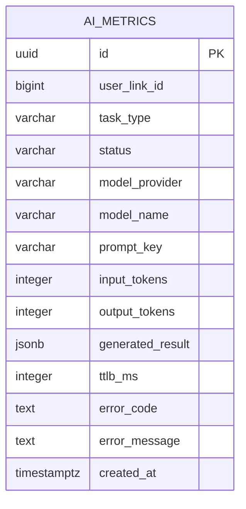

# ai_metrics

링크를 대상으로 실행한 LLM 호출 결과 로그 테이블이다.
text/object 결과, 모델, 토큰, TTLB, 실패 사유를 append-only로 기록한다.

진행 중 상태는 저장하지 않는다.
LLM 호출이 성공 또는 실패로 확정된 뒤 row 하나를 기록하며, metrics 저장 실패는 원래 생성 흐름에 영향을 주지 않는다.

## ERD



## 필드

| 필드 | 타입 | 필수 | 설명 |
| --- | --- | --- | --- |
| id | uuid | Y | AI metric 식별자 |
| user_link_id | bigint | Y | LLM 호출 대상인 사용자 저장 링크 ID. 대상 테이블명은 미정이며 물리 FK 없이 논리 참조 |
| task_type | varchar | Y | 호출 목적을 구분하는 metrics 분류값 |
| status | varchar | Y | LLM 호출 결과. `SUCCESS`, `FAILED` |
| model_provider | varchar | Y | 실제 호출 provider. `openai`, `gemini` |
| model_name | varchar | Y | 요청한 model 이름 |
| prompt_key | varchar | N | prompt 식별자/버전 |
| input_tokens | integer | N | 입력 토큰 수 |
| output_tokens | integer | N | 출력 토큰 수 |
| generated_result | jsonb | N | text 호출의 JSON string 또는 object 호출의 검증된 JSON 값 |
| ttlb_ms | integer | Y | LLM 요청 시작부터 응답/실패 확정까지 걸린 시간(ms) |
| error_code | text | N | 실패 코드 |
| error_message | text | N | 실패 메시지 |
| created_at | timestamptz | Y | metric 생성 일시 |

## Task Type

현재 분류값은 다음과 같다.

- `SUMMARY_GENERATE`
- `TAG_GENERATE`

task type은 metrics 분류만 담당한다.
task별 prompt, 결과 schema, parsing, 품질 판정은 `AiService`의 public 유스케이스가 정의한다.
생성 결과의 도메인 반영과 저장은 해당 데이터를 소유한 모듈이 담당한다.
metrics 계층과 LLM infrastructure는 해당 비즈니스 정책을 결정하지 않는다.

## generated_result

### Text 호출

`generateText` 결과는 JSON string으로 저장한다.

```json
"생성된 텍스트"
```

### Object 호출

`generateObject` 결과는 호출자가 전달한 Zod schema를 통과한 JSON 값을 저장한다.

```json
{
  "values": ["first", "second"]
}
```

`FAILED`에서는 `generated_result = NULL`이다.
JSONB 내부 필드 검색 요구사항이 생기기 전까지 GIN index는 두지 않는다.

## 상태

- `SUCCESS`: provider 호출이 성공했고, object 호출이면 JSON parse와 schema 검증까지 통과한 상태
- `FAILED`: provider 호출, JSON parse 또는 schema 검증이 실패한 상태

도메인 품질 판정 상태는 `ai_metrics.status`에 포함하지 않는다.
schema 변환, API key, target 같은 provider 요청 전 configuration 오류도 LLM 호출 metric에 포함하지 않는다.

## 제약과 인덱스

```sql
CREATE INDEX ai_metrics_user_link_task_status_idx
  ON ai_metrics (user_link_id, task_type, status);
```

- `user_link_id + task_type + status`: 링크와 작업별 성공/실패 조회
- 입력/출력 토큰을 제공하지 않는 provider는 token 필드를 `NULL`로 둘 수 있다.
- prompt 버전은 `prompt_key`에 포함한다.

## Retry

provider SDK 내부 retry는 같은 metric row에 포함된다.
호출 유스케이스가 다시 `generateText` 또는 `generateObject`를 호출하면 새 metric row로 기록된다.
동일 작업의 호출 횟수나 실패 횟수는 `user_link_id`, `task_type`, `status` 조건으로 집계한다.
비즈니스 retry 제한이 필요하면 호출 유스케이스가 별도 실행 식별자와 정책을 관리한다.

metrics 기록은 best-effort다.
저장 실패는 로그만 남기고 LLM 결과나 원래 오류를 덮지 않는다.
