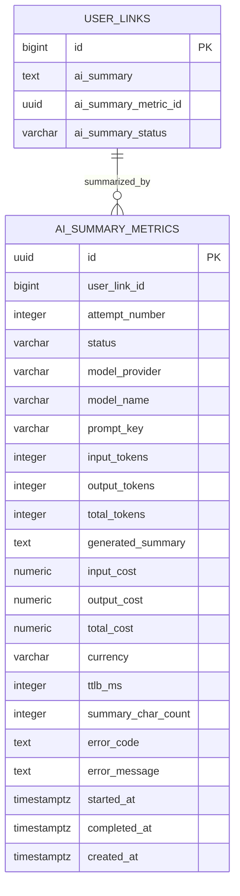

# ai_summary_metrics

사용자 저장 링크에 대한 AI 요약 메트릭 테이블이다. 서비스에 반영되는 최종 요약은 `user_links.ai_summary`에 저장하고, 각 요약 시도에서 생성된 요약문, 모델, 토큰, 비용, TTLB, 실패 사유는 이 테이블에 누적한다.

이 테이블은 실행 이력과 관측 데이터 성격이 강하므로 물리 FK 없이 기록한다. AI 호출 실패, 타임아웃, 요약 반영 실패가 발생해도 메트릭 row는 독립적으로 남길 수 있어야 한다.

## ERD



## 필드

| 필드 | 타입 | 필수 | 설명 |
| --- | --- | --- | --- |
| id | uuid | Y | AI 요약 메트릭 식별자. 비동기 작업 추적을 위해 애플리케이션에서 선발급 가능 |
| user_link_id | bigint | Y | 요약 대상 사용자 저장 링크 ID. 물리 FK 없이 논리 참조로 저장 |
| attempt_number | integer | Y | 같은 사용자 저장 링크 내 요약 시도 순번. 최초 시도는 `1` |
| status | varchar | Y | 요약 시도 상태. 예: `PENDING`, `SUCCESS`, `NEEDS_REVIEW`, `FAILED` |
| model_provider | varchar | Y | 모델 제공자. 예: `openai` |
| model_name | varchar | Y | 사용한 모델명 |
| prompt_key | varchar | N | 요약 프롬프트 식별 키. 버전이 필요한 프롬프트는 키에 포함 |
| input_tokens | integer | N | 입력 토큰 수 |
| output_tokens | integer | N | 출력 토큰 수 |
| total_tokens | integer | N | 전체 토큰 수 |
| generated_summary | text | N | 이 요약 시도에서 생성된 요약문 |
| input_cost | numeric | N | 입력 토큰 비용 |
| output_cost | numeric | N | 출력 토큰 비용 |
| total_cost | numeric | N | 전체 비용 |
| currency | varchar | N | 비용 통화. 예: `USD`, `KRW` |
| ttlb_ms | integer | N | AI 요약 요청 시작부터 전체 응답 수신 완료까지 걸린 시간(ms) |
| summary_char_count | integer | N | 생성된 요약 문자열 길이 |
| error_code | text | N | 실패 또는 비정상 처리 코드 |
| error_message | text | N | 실패 또는 비정상 처리 메시지 |
| started_at | timestamptz | Y | 요약 시도 시작 일시 |
| completed_at | timestamptz | N | 요약 시도 완료 일시 |
| created_at | timestamptz | Y | 레코드 생성 일시 |

## 제약

- `ai_summary_metrics`는 실패 기록 보장을 우선하므로 DB 물리 FK를 두지 않는다.
- 같은 사용자 저장 링크 안에서는 `user_link_id + attempt_number`가 유니크해야 한다.
- `status = SUCCESS`인 메트릭의 `generated_summary`를 `user_links.ai_summary`의 기본 채택 대상으로 본다.
- `status = NEEDS_REVIEW`는 요약은 생성됐지만 품질 확인이 필요한 시도를 의미한다. 예: 300자 미만, 처리 시간 임계값 초과, 원문 부족.
- `status = FAILED`는 재시도 한도 초과 또는 복구 불가 오류를 의미한다.
- `ai_summary_metrics.status`는 개별 요약 시도의 상태이며, 사용자 저장 링크 단위 대표 상태는 `user_links.ai_summary_status`에 저장한다.
- 비용은 호출 당시 단가 기준으로 저장한다. 이후 모델 단가가 바뀌어도 과거 실행 비용은 재계산하지 않는다.
- 입력/출력 토큰 또는 비용을 제공하지 않는 모델은 해당 필드를 `NULL`로 둘 수 있다.
- 프롬프트 버전이 필요한 경우 별도 컬럼을 두지 않고 `prompt_key`에 포함한다. 예: `link_summary_default_v1`.
- 재요약이 발생하면 새 메트릭 row를 추가하고, 각 `generated_summary`는 이력으로 보존한다.
- 서비스에 반영된 요약은 `user_links.ai_summary_metric_id`가 가리키는 메트릭 row의 `generated_summary`와 같아야 한다.

## 인덱스 설계

```sql
CREATE UNIQUE INDEX ai_summary_metrics_user_link_attempt_idx
  ON ai_summary_metrics (user_link_id, attempt_number);

CREATE INDEX ai_summary_metrics_user_link_status_idx
  ON ai_summary_metrics (user_link_id, status);

CREATE INDEX ai_summary_metrics_model_created_at_idx
  ON ai_summary_metrics (model_provider, model_name, created_at);
```

- `user_link_id + attempt_number`: 같은 사용자 저장 링크의 재시도 순번 중복 방지.
- `user_link_id + status`: 특정 사용자 저장 링크의 성공/실패 요약 시도 조회용.
- `model_provider + model_name + created_at`: 모델별 비용/성능 집계용.

## 재시도 정책

- 최초 실행 실패 시 1회 재시도한다.
- 재시도까지 실패하면 해당 사용자 저장 링크의 `ai_summary_status`를 `FAILED`로 전환한다.
- 재시도 횟수 제한은 `ai_summary_metrics`의 row 수 또는 `attempt_number`로 판단한다.
- 재시도 대상 에러와 즉시 실패 처리할 에러는 애플리케이션 정책에서 구분한다.
