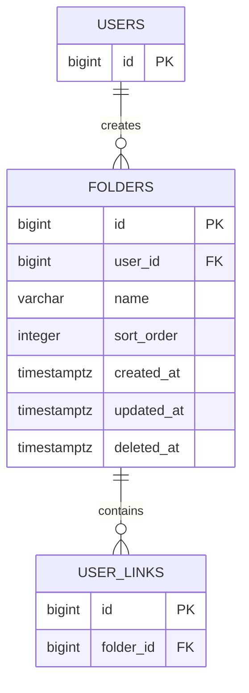

# folders

사용자가 생성한 커스텀 폴더 테이블이다. 기본 폴더인 `전체`, `미분류`, `최근 삭제된 항목`은 실제 행으로 저장하지 않고 조회 조건으로 표현한다.

## ERD

## 필드

| 필드 | 타입 | 필수 | 설명 |
| --- | --- | --- | --- |
| id | bigint | Y | 폴더 식별자 |
| user_id | bigint | Y | 폴더를 생성한 회원 ID |
| name | varchar | Y | 폴더명. 최대 20자 |
| sort_order | integer | N | 사용자별 폴더 노출 순서 |
| created_at | timestamptz | Y | 폴더 생성 일시 |
| updated_at | timestamptz | Y | 폴더 수정 일시 |
| deleted_at | timestamptz | N | 폴더 삭제 일시 |

## 제약

- 사용자당 커스텀 폴더는 최대 30개까지 생성할 수 있다.
- 동일한 폴더명 생성이 가능하므로 `user_id + name` 유니크 제약은 두지 않는다.
- 폴더 삭제 시 포함된 링크는 최근 삭제 상태로 변경한다.
- 폴더 삭제 후 링크 복원 시 미분류로 이동하므로 `user_links.folder_id`는 `NULL`로 정리한다.
