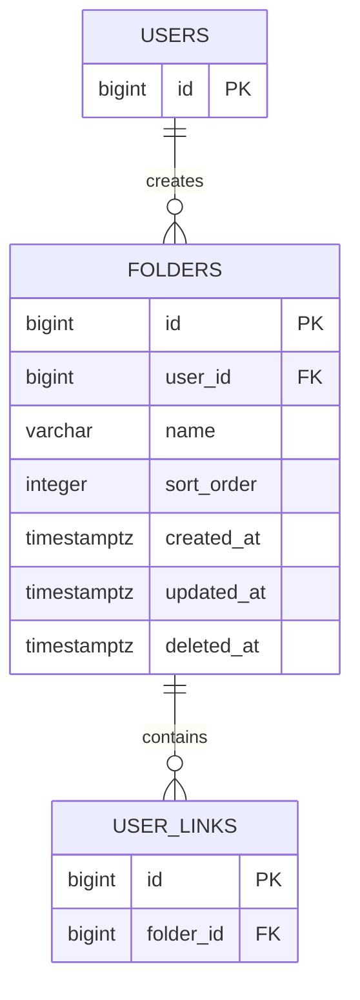

# folders

사용자가 생성한 커스텀 폴더 테이블이다. 화면에서 폴더처럼 표시되는 `전체`, `미분류`, `즐겨찾기`, `최근 삭제`는 이 테이블의 행이 아니며 링크 조회 조건으로 표현한다. `최근 삭제`는 삭제된 폴더가 아니라 soft delete된 링크 목록이다.

## ERD



## 필드

| 필드       | 타입        | 필수 | 설명                                |
| ---------- | ----------- | ---- | ----------------------------------- |
| id         | bigint      | Y    | 폴더 식별자                         |
| user_id    | bigint      | Y    | 폴더를 생성한 회원 ID               |
| name       | varchar     | Y    | 폴더명. 최대 255자 (`varchar(255)`) |
| sort_order | integer     | N    | 사용자별 폴더 노출 순서             |
| created_at | timestamptz | Y    | 폴더 생성 일시                      |
| updated_at | timestamptz | Y    | 폴더 수정 일시                      |
| deleted_at | timestamptz | N    | 폴더 삭제 일시                      |

## 제약

- 사용자당 커스텀 폴더는 최대 30개까지 생성할 수 있다.
- 활성 폴더(`deleted_at IS NULL`)는 `user_id + name`이 유니크하다. 삭제된 폴더가 이름을 점유하지 않도록 partial unique index로 DB에서 보장하며, 동시 생성/rename 경쟁도 DB 레벨에서 차단한다.
- 폴더 삭제 시 포함된 링크는 최근 삭제 상태로 변경한다.
- 폴더 삭제 후 링크 복원 시 미분류로 이동하므로 `user_links.folder_id`는 `NULL`로 정리한다.

## 인덱스 설계

```sql
CREATE UNIQUE INDEX folders_user_id_name_active_idx
  ON folders (user_id, name)
  WHERE deleted_at IS NULL;
```

- `user_id + name` (활성 한정): 사용자별 활성 폴더명 중복 방지. 애플리케이션의 사전 검증은 친절한 에러용 fast-path이고, 최종 유일성은 이 인덱스가 보장한다.
