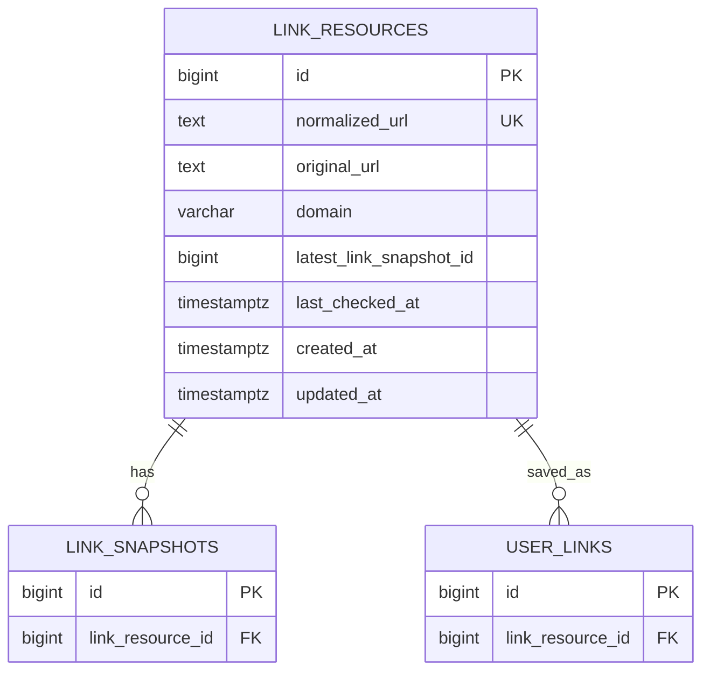

# link_resources

정규화 URL로 묶이는 링크 원본 리소스 테이블이다. 같은 URL을 여러 사용자가 저장하더라도 링크 원본은 이 테이블에서 한 번만 관리하고, 사용자별 저장 상태는 `user_links`에서 관리한다.

## ERD

## 필드

| 필드 | 타입 | 필수 | 설명 |
| --- | --- | --- | --- |
| id | bigint | Y | 링크 리소스 식별자 |
| normalized_url | text | Y | 같은 URL 판단에 사용하는 정규화 URL |
| original_url | text | Y | 최초 저장 또는 대표로 보관할 원본 URL |
| domain | varchar | N | 출처 표시와 검색에 사용하는 도메인 |
| latest_link_snapshot_id | bigint | N | 현재 최신 링크 스냅샷 ID. 물리 FK 없이 논리 참조로 저장 |
| last_checked_at | timestamptz | N | URL 변경 여부를 마지막으로 확인한 일시 |
| created_at | timestamptz | Y | 레코드 생성 일시 |
| updated_at | timestamptz | Y | 레코드 수정 일시 |

## 제약

- `normalized_url`은 전역 유니크로 둔다.
- 사용자별 중복 저장 제한은 `link_resources`가 아니라 `user_links`에서 처리한다.
- URL 정규화 규칙은 애플리케이션 정책으로 관리한다. 예: trailing slash, query parameter 정렬, tracking parameter 제거 여부.
- `latest_link_snapshot_id`는 `link_snapshots.link_resource_id`와의 순환 참조를 피하기 위해 물리 FK를 두지 않는다.
