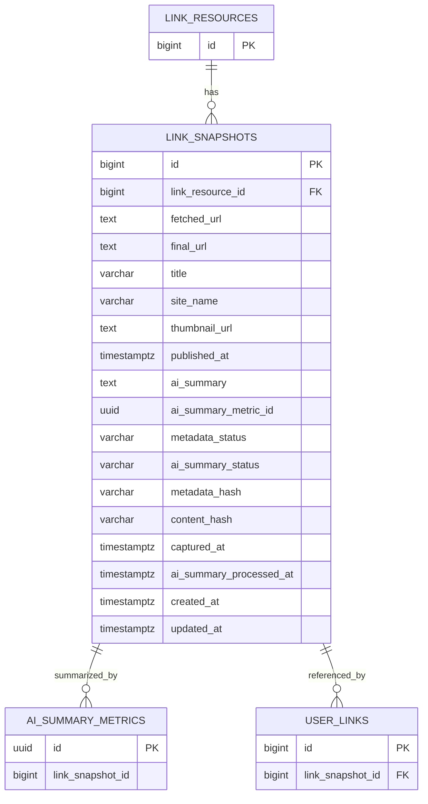

# link_snapshots

링크를 특정 시점에 수집한 메타데이터와 AI 요약 결과를 저장하는 스냅샷 테이블이다. 원본 링크의 제목, 대표 이미지, 본문, 요약이 바뀌어도 사용자가 저장한 당시의 상태를 보존하기 위해 `user_links.link_snapshot_id`가 이 테이블을 참조한다.

## ERD

## 필드

| 필드 | 타입 | 필수 | 설명 |
| --- | --- | --- | --- |
| id | bigint | Y | 링크 스냅샷 식별자 |
| link_resource_id | bigint | Y | 스냅샷이 속한 링크 리소스 ID |
| fetched_url | text | Y | 수집을 시도한 URL |
| final_url | text | N | redirect 이후 최종 URL |
| title | varchar | N | 수집된 제목. 수집 실패 시 `NULL` 가능 |
| site_name | varchar | N | 수집된 사이트명 또는 출처 표시명. 수집 실패 시 `NULL` 가능 |
| thumbnail_url | text | N | 수집된 대표 이미지 URL |
| published_at | timestamptz | N | 원문 발행 일시. 제공되지 않으면 `NULL` |
| ai_summary | text | N | 최종 채택된 AI 요약 결과 |
| ai_summary_metric_id | uuid | N | 현재 `ai_summary`의 출처가 된 AI 요약 메트릭 ID. 물리 FK 없이 논리 참조로 저장 |
| metadata_status | varchar | Y | 메타데이터 수집 상태. 예: `PENDING`, `SUCCESS`, `FAILED` |
| ai_summary_status | varchar | Y | AI 요약 처리 상태. 예: `PENDING`, `SUCCESS`, `NEEDS_REVIEW`, `FAILED` |
| metadata_hash | varchar | N | 제목, 출처, 썸네일 등 메타데이터 변경 비교용 해시 |
| content_hash | varchar | N | 본문 또는 요약 대상 콘텐츠 변경 비교용 해시 |
| captured_at | timestamptz | Y | 스냅샷 수집 일시 |
| ai_summary_processed_at | timestamptz | N | AI 요약 처리 완료 일시 |
| created_at | timestamptz | Y | 레코드 생성 일시 |
| updated_at | timestamptz | Y | 레코드 수정 일시 |

## 스냅샷 생성 정책

- 저장하려는 URL의 `link_resources`가 없으면 링크 리소스와 최초 스냅샷을 생성한다.
- 이미 등록된 URL이면 최신 스냅샷과 새 수집 결과의 `metadata_hash`, `content_hash`를 비교한다.
- 변경이 없으면 새 스냅샷을 만들지 않고 최신 스냅샷을 재사용한다.
- 변경이 있으면 새 스냅샷을 만들고 `link_resources.latest_link_snapshot_id`를 갱신한다.
- 기존 스냅샷이 없거나 해시 계산이 불가능하면 새 스냅샷을 생성한다.

## AI 요약 상태 정책

- `link_snapshots.ai_summary_status`는 스냅샷 단위의 대표 요약 상태를 저장한다.
- `ai_summary_metrics.status`는 개별 요약 시도의 실행 상태를 저장한다.
- `PENDING`: 요약 대기 또는 처리 중.
- `SUCCESS`: 정상 요약 완료.
- `NEEDS_REVIEW`: 요약은 생성됐지만 품질 확인이 필요함. 예: 300자 미만, 처리 시간 임계값 초과, 원문 부족.
- `FAILED`: 재시도 한도 초과 또는 복구 불가 오류.
- 각 AI 요약 시도의 모델, 토큰, 비용, 소요시간, 에러, 생성 요약문은 `ai_summary_metrics`에 저장한다.
- `link_snapshots.ai_summary_metric_id`는 현재 `ai_summary`의 출처가 된 메트릭 row를 논리 참조한다.

## 제약

- 메타데이터 수집 실패 정책에 따라 `title`, `site_name`, `published_at`은 nullable로 둔다.
- AI 요약은 최초 실패 후 1회 재시도하고, 재시도 실패 시 `FAILED`로 전환한다.
- `NEEDS_REVIEW`는 내부 품질 확인 상태로 저장한다.
- 처리 시간 임계값과 300자 미만 기준은 애플리케이션 정책에서 결정한다.
- `ai_summary_metric_id`는 메트릭 실패 기록 보장과 순환 참조 회피를 위해 물리 FK를 두지 않는다.
