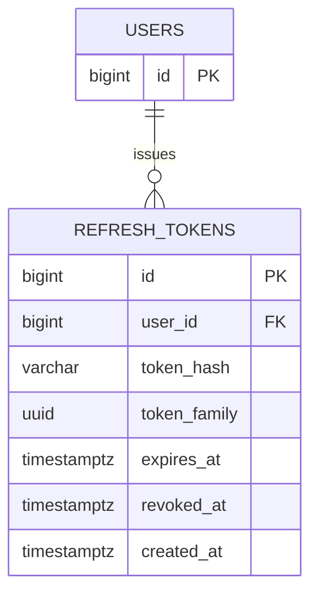

# refresh_tokens

리프레시 토큰을 저장하는 테이블이다. 토큰 원문 대신 해시만 보관하고, RTR(Refresh Token Rotation) 방식으로 재사용/탈취를 탐지한다.

토큰을 재발급(회전)할 때마다 새 행을 만들고 이전 행을 폐기하며, 같은 로그인 세션에서 파생된 토큰들은 `token_family`로 묶는다. 폐기된 토큰이 다시 사용되면 해당 `token_family` 전체를 revoke한다.

<br>

## ERD



<br>

## 필드

| 필드 | 타입 | 필수 | 설명 |
| --- | --- | --- | --- |
| id | bigint | Y | 리프레시 토큰 식별자 |
| user_id | bigint | Y | 토큰 소유 회원 ID |
| token_hash | varchar | Y | 토큰 원문의 sha256 해시(hex 64자). 원문은 저장하지 않는다 |
| token_family | uuid | Y | 회전 체인 식별자. 탈취 감지 시 family 단위로 일괄 revoke |
| expires_at | timestamptz | Y | 토큰 만료 일시 |
| revoked_at | timestamptz | N | 폐기 일시. `NULL`이면 유효 |
| created_at | timestamptz | Y | 토큰 발급 일시 |

<br>

## 제약

- `user_id`는 `users`를 참조하며, 회원 삭제 시 토큰도 함께 삭제된다. (`ON DELETE CASCADE`)
- `token_hash`는 유니크하다. 토큰 원문은 저장하지 않고 검증 시 해시를 비교한다.
- 유효 여부는 `revoked_at IS NULL AND expires_at > now()`로 판단한다.
- 회전 시 이전 토큰의 `revoked_at`을 채우고 같은 `token_family`로 새 토큰을 발급한다.
- 폐기된 토큰이 재사용되면 해당 `token_family`의 모든 토큰을 revoke한다.

<br>

## 인덱스 설계

```sql
CREATE UNIQUE INDEX refresh_tokens_token_hash_idx
  ON refresh_tokens (token_hash);

CREATE INDEX refresh_tokens_user_id_idx
  ON refresh_tokens (user_id);

CREATE INDEX refresh_tokens_family_idx
  ON refresh_tokens (token_family);
```

- `token_hash` (유니크): 토큰 검증 시 해시로 단건 조회.
- `user_id`: 사용자별 토큰 조회/정리.
- `token_family`: family 단위 일괄 revoke.

<br>

## 향후 확장

- 만료된 토큰(`expires_at <= now()`)은 주기적 배치로 정리한다.
- 디바이스/세션 식별 정보가 필요해지면 컬럼을 추가한다.
