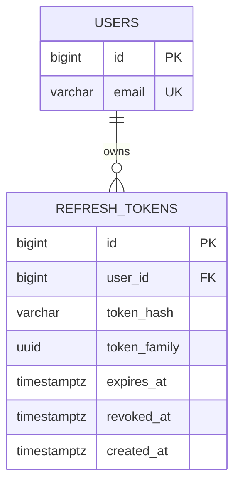

# refresh_tokens

Refresh Token Rotation 방식으로 발급된 토큰을 관리하는 테이블이다. 토큰 원문 대신 SHA-256 해시만 저장하며, `token_family`로 rotation 체인을 추적해 탈취된 토큰의 재사용을 감지한다.

## ERD

## 필드

| 필드 | 타입 | 필수 | 설명 |
| --- | --- | --- | --- |
| id | bigint | Y | 토큰 고유 ID |
| user_id | bigint | Y | USERS.id 참조. 유저 삭제 시 cascade |
| token_hash | varchar(64) | Y | SHA-256(refreshToken). 원문은 저장하지 않는다 |
| token_family | uuid | Y | rotation 체인 식별자. 재발급 시 동일 family를 유지 |
| expires_at | timestamptz | Y | 토큰 만료 일시 |
| revoked_at | timestamptz | N | 명시적 폐기 일시. null이면 유효한 토큰 |
| created_at | timestamptz | Y | 레코드 생성 일시 |

## 인덱스

| 이름 | 컬럼 | 종류 | 설명 |
| --- | --- | --- | --- |
| refresh_tokens_token_hash_idx | token_hash | UNIQUE | 토큰 조회 및 중복 방지 |
| refresh_tokens_user_id_idx | user_id | INDEX | 유저별 토큰 일괄 삭제용 |
| refresh_tokens_family_idx | token_family | INDEX | rotation 체인 추적용 |

## 제약

- `token_hash`는 클라이언트에 내려준 refreshToken의 SHA-256 해시값이다.
- `token_family`는 최초 발급 시 생성되며, rotation 시 그대로 이어받는다. 동일 family의 이미 폐기된 토큰으로 재사용이 시도되면 탈취로 간주한다.
- 로그아웃·탈퇴·rotation 시 해당 토큰(또는 유저의 전체 토큰)을 삭제한다.
- 멀티 디바이스 로그인을 지원하는 구조다 (유저당 복수 토큰 허용).
