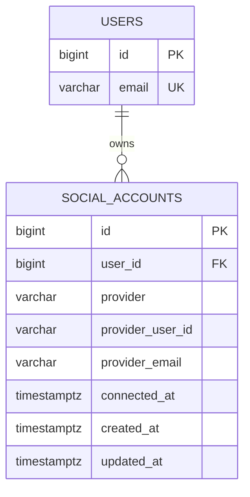

# social_accounts

Google, Kakao 소셜 로그인 계정을 회원과 연결하는 테이블이다.

## ERD

## 필드

| 필드 | 타입 | 필수 | 설명 |
| --- | --- | --- | --- |
| id | bigint | Y | 소셜 계정 연결 식별자 |
| user_id | bigint | Y | 연결된 회원 ID |
| provider | varchar | Y | 소셜 로그인 제공자. 예: `google`, `kakao` |
| provider_user_id | varchar | Y | 제공자 내 사용자 고유 ID |
| provider_email | varchar | N | 제공자가 내려준 이메일 |
| connected_at | timestamptz | Y | 소셜 계정 최초 연결 일시 |
| created_at | timestamptz | Y | 레코드 생성 일시 |
| updated_at | timestamptz | Y | 레코드 수정 일시 |

## 제약

- `provider + provider_user_id`는 유니크해야 한다.
- 한 회원은 동일 제공자를 하나만 연결할 수 있다.
