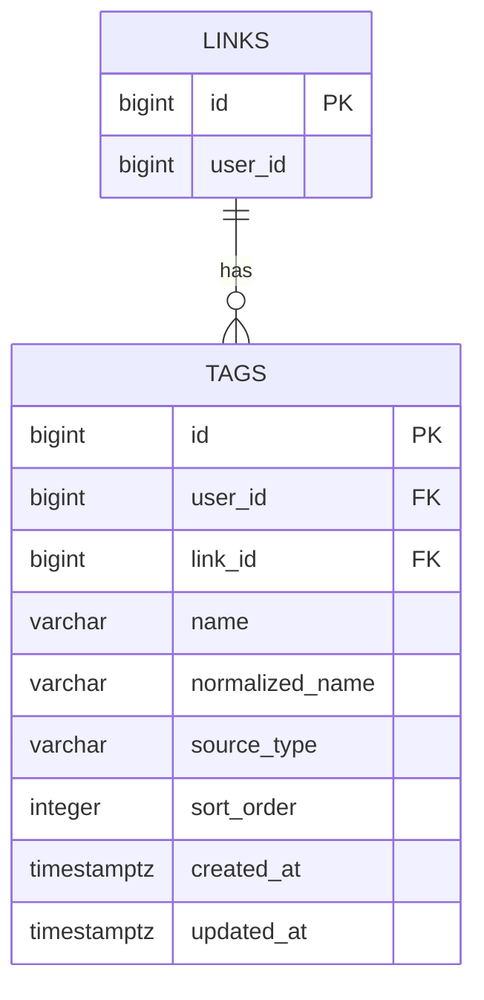

# tags

사용자가 저장한 링크에 붙는 태그 테이블이다. 태그 삭제가 해당 링크에만 영향을 주어야 하므로 태그를 전역 사전으로 분리하지 않고 `links`별 태그로 저장한다.

태그는 표시용 필드에 그치지 않고, 같은 태그 또는 비슷한 태그를 가진 링크를 검색/추천할 때 가중치 계산에 사용할 수 있다.
검색/추천은 사용자 내부 범위가 기본이므로 `user_id`를 함께 저장한다.

## ERD



- `LINKS ||--o{ TAGS` 관계는 단독 `link_id` FK가 아니라 `(link_id, user_id)` **복합 FK**로 구현한다. (아래 [외래 키](#외래-키) 참조)
- `tags`는 `users`를 직접 참조하지 않는다. 소유자는 복합 FK를 통해 `links`에서 정해지며, 사용자 존재 보장은 `links`가 `users` FK를 갖게 될 때 전이적으로 커버된다.

<br>

## 필드

| 필드 | 타입 | 필수 | 설명 |
| --- | --- | --- | --- |
| id | bigint | Y | 태그 식별자 |
| user_id | bigint | Y | 태그 소유 회원 ID. 사용자 내부 검색/추천 필터 기준. `(link_id, user_id)` 복합 FK의 일부 (users 단독 FK는 없음) |
| link_id | bigint | Y | 태그가 연결된 저장 링크 ID. `(link_id, user_id)` 복합 FK의 일부 (단독 FK 아님) |
| name | varchar | Y | 태그명. 최대 20자 |
| normalized_name | varchar | Y | 중복 판단용 정규화 태그명 |
| source_type | varchar | Y | 태그 생성 출처. 예: `user`, `rule`, `ai` |
| sort_order | integer | N | 링크 상세 화면에서의 태그 노출 순서 |
| created_at | timestamptz | Y | 태그 생성 일시 |
| updated_at | timestamptz | Y | 태그 수정 일시 |

<br>

## 외래 키

| 제약명 | 컬럼 | 참조 | ON DELETE |
| --- | --- | --- | --- |
| `tags_link_id_user_id_fk` | `(link_id, user_id)` | `links(id, user_id)` | CASCADE |

- `tags`의 FK는 이 복합 FK **하나뿐**이다. `user_id`는 단독 FK 없이 이 복합 FK를 통해서만 `links`와 묶인다. (`user_id → users` 단독 FK는 links의 users FK 방침과 맞추기 위해 두지 않는다)
- `link_id`는 단독 FK가 아니라 `user_id`와 묶인 **복합 FK**의 일부다. 이를 통해 태그 소유자와 링크 소유자가 항상 같도록 DB가 강제한다.
- 복합 FK 참조 대상인 `links(id, user_id)`에는 유니크 제약(`links_id_user_id_unique`)이 있어야 한다. ([user_links](./user_links.md) 참조)
- 링크가 삭제되면 복합 FK의 `CASCADE`로 그 링크의 태그도 함께 삭제된다.

<br>

## 제약

- 링크당 최대 10개의 태그를 허용한다.
- 한 저장 링크 안에서는 `link_id + normalized_name` 유니크 제약을 둔다.
- `tags.user_id`는 `links.user_id`와 항상 같다. (복합 FK로 DB에서 강제 — 위 [외래 키](#외래-키) 참조)
- 링크 복원 시 기존 태그도 함께 복원한다.
- 추천 랭킹에서는 태그 exact match와 유사도 match를 활용할 수 있다.
- 모든 사용자/링크가 공유하는 전역 태그 사전은 두지 않는다. `tags`는 링크별로 행을 둔다.

## 생성 출처

- `user`: 사용자가 직접 추가한 태그.
- `rule`: 도메인, URL, 제목, 메타데이터 등 명시적인 규칙으로 생성한 태그.
- `ai`: AI 모델이 링크 내용을 기반으로 생성한 태그.

## 인덱스 설계

```sql
CREATE UNIQUE INDEX tags_link_id_normalized_name_idx
  ON tags (link_id, normalized_name);

CREATE INDEX tags_user_id_normalized_name_idx
  ON tags (user_id, normalized_name);

CREATE INDEX tags_normalized_name_trgm_idx
  ON tags USING gin (normalized_name gin_trgm_ops);
```

- `link_id + normalized_name`: 한 저장 링크 안에서 같은 태그 중복 추가 방지.
- `user_id + normalized_name`: 사용자 내부에서 같은 태그를 가진 링크를 찾는 exact match 추천/검색용.
- `normalized_name gin_trgm_ops`: 유사 태그 추천용. PostgreSQL `pg_trgm` 확장이 필요하다.
- 추천 쿼리는 `tags.user_id = :userId`로 사용자 범위를 먼저 제한하고, `links.deleted_at IS NULL`인 링크만 대상으로 한다.
- `user_id`는 `links`에서 파생 가능한 값이지만, 사용자 내부 검색/추천 쿼리에서 매번 조인으로 범위를 좁히지 않기 위해 중복 저장한다.
- `user_id` 중복 저장의 정합성은 `(link_id, user_id)` → `links(id, user_id)` 복합 FK로 DB가 보장하므로, 애플리케이션에서 별도 검증이 필요 없다.

## 추천 가중치

- 같은 `normalized_name` 태그가 겹치면 높은 가중치를 준다.
- `pg_trgm`의 `similarity(normalized_name, :tag)`가 임계값 이상이면 낮은 가중치를 준다.
- 사용자가 직접 추가한 태그(`source_type = user`)는 시스템 생성 태그보다 높은 가중치를 줄 수 있다.
- 규칙 기반 태그(`source_type = rule`)와 AI 생성 태그(`source_type = ai`)는 생성 신뢰도와 추천 목적에 따라 가중치를 다르게 둘 수 있다.
- 같은 폴더, 같은 도메인, 최신 저장 시각 같은 신호와 조합해 최종 추천 점수를 계산한다.
- 유사도 임계값과 가중치 값은 실제 데이터로 튜닝이 필요하다.
