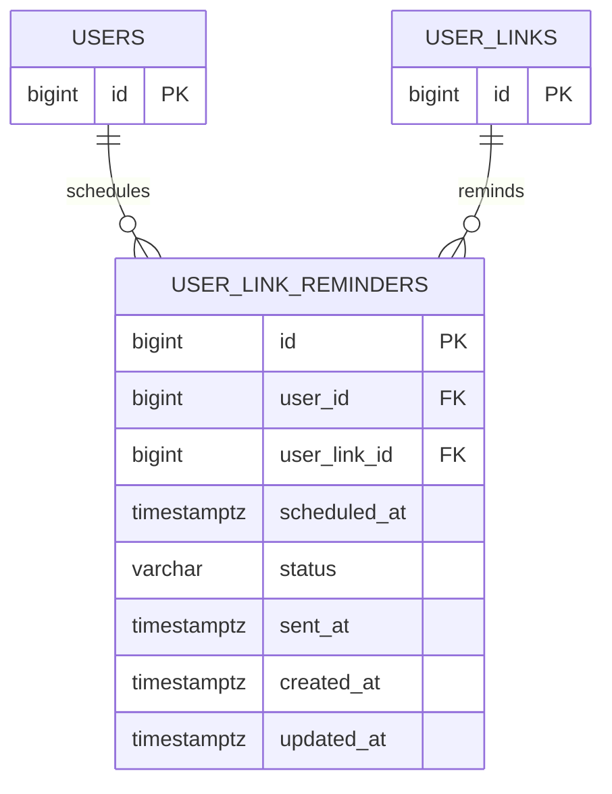

# user_link_reminders

사용자가 저장한 링크에 대한 리마인드 예약/발송 상태 테이블이다. 리마인드 예약 시각과 발송 결과를 사용자 저장 링크 단위로 관리한다.

## ERD

## 필드

| 필드 | 타입 | 필수 | 설명 |
| --- | --- | --- | --- |
| id | bigint | Y | 리마인드 식별자 |
| user_id | bigint | Y | 리마인드를 받을 회원 ID |
| user_link_id | bigint | Y | 리마인드 대상 사용자 저장 링크 ID |
| scheduled_at | timestamptz | Y | 리마인드 예정 일시 |
| status | varchar | Y | 리마인드 상태. 예: `PENDING`, `SENT`, `CANCELED`, `FAILED` |
| sent_at | timestamptz | N | 실제 발송 완료 일시 |
| created_at | timestamptz | Y | 예약 생성 일시 |
| updated_at | timestamptz | Y | 예약 수정 일시 |

## 운영 정책

- 리마인드 발송 채널은 알림 정책에서 결정한다.
- 반복 리마인드, 발송 실패 재시도, 사용자 알림 수신 동의는 알림 도메인에서 관리한다.
- 링크가 최근 삭제 상태이거나 영구 삭제된 경우 예약을 취소한다.
