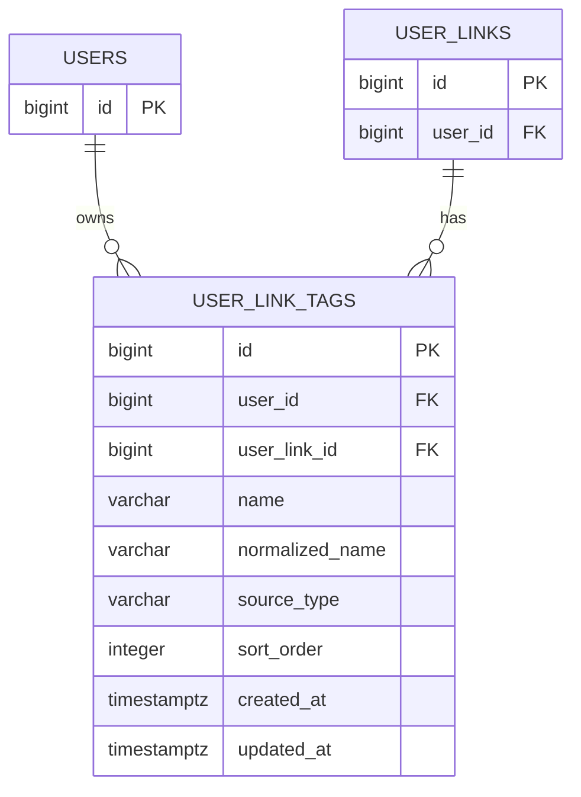

# user_link_tags

사용자가 저장한 링크에 붙는 태그 테이블이다. 태그 삭제가 해당 링크에만 영향을 주어야 하므로 태그를 전역 사전으로 분리하지 않고 `user_links`별 태그로 저장한다.

태그는 표시용 필드에 그치지 않고, 같은 태그 또는 비슷한 태그를 가진 링크를 검색/추천할 때 가중치 계산에 사용할 수 있다.
검색/추천은 사용자 내부 범위가 기본이므로 `user_id`를 함께 저장한다.

## ERD



## 필드

| 필드 | 타입 | 필수 | 설명 |
| --- | --- | --- | --- |
| id | bigint | Y | 링크 태그 식별자 |
| user_id | bigint | Y | 태그 소유 회원 ID. 사용자 내부 검색/추천 필터 기준 |
| user_link_id | bigint | Y | 태그가 연결된 사용자 저장 링크 ID |
| name | varchar | Y | 태그명. 최대 20자 |
| normalized_name | varchar | Y | 중복 판단용 정규화 태그명 |
| source_type | varchar | Y | 태그 생성 출처. 예: `user`, `rule`, `ai` |
| sort_order | integer | N | 링크 상세 화면에서의 태그 노출 순서 |
| created_at | timestamptz | Y | 태그 생성 일시 |
| updated_at | timestamptz | Y | 태그 수정 일시 |

## 제약

- 링크당 최대 10개의 태그를 허용한다.
- 한 사용자 저장 링크 안에서는 `user_link_id + normalized_name` 유니크 제약을 둔다.
- `user_link_tags.user_id`는 `user_links.user_id`와 항상 같아야 한다.
- 링크 복원 시 기존 태그도 함께 복원한다.
- 추천 랭킹에서는 태그 exact match와 유사도 match를 활용할 수 있다.
- 전역 `tags` 테이블은 두지 않는다.

## 생성 출처

- `user`: 사용자가 직접 추가한 태그.
- `rule`: 도메인, URL, 제목, 메타데이터 등 명시적인 규칙으로 생성한 태그.
- `ai`: AI 모델이 링크 내용을 기반으로 생성한 태그.

## 인덱스 설계

```sql
CREATE UNIQUE INDEX user_link_tags_user_link_id_normalized_name_idx
  ON user_link_tags (user_link_id, normalized_name);

CREATE INDEX user_link_tags_user_id_normalized_name_idx
  ON user_link_tags (user_id, normalized_name);

CREATE INDEX user_link_tags_normalized_name_trgm_idx
  ON user_link_tags USING gin (normalized_name gin_trgm_ops);
```

- `user_link_id + normalized_name`: 한 저장 링크 안에서 같은 태그 중복 추가 방지.
- `user_id + normalized_name`: 사용자 내부에서 같은 태그를 가진 링크를 찾는 exact match 추천/검색용.
- `normalized_name gin_trgm_ops`: 유사 태그 추천용. PostgreSQL `pg_trgm` 확장이 필요하다.
- 추천 쿼리는 `user_link_tags.user_id = :userId`로 사용자 범위를 먼저 제한하고, `user_links.deleted_at IS NULL`인 링크만 대상으로 한다.
- `user_id`는 `user_links`에서 파생 가능한 값이지만, 사용자 내부 검색/추천 쿼리에서 매번 조인으로 범위를 좁히지 않기 위해 중복 저장한다.
- `user_id` 중복 저장으로 인해 생성/수정 시 `user_links.user_id`와의 정합성 검증이 필요하다.

## 추천 가중치

- 같은 `normalized_name` 태그가 겹치면 높은 가중치를 준다.
- `pg_trgm`의 `similarity(normalized_name, :tag)`가 임계값 이상이면 낮은 가중치를 준다.
- 사용자가 직접 추가한 태그(`source_type = user`)는 시스템 생성 태그보다 높은 가중치를 줄 수 있다.
- 규칙 기반 태그(`source_type = rule`)와 AI 생성 태그(`source_type = ai`)는 생성 신뢰도와 추천 목적에 따라 가중치를 다르게 둘 수 있다.
- 같은 폴더, 같은 도메인, 최신 저장 시각 같은 신호와 조합해 최종 추천 점수를 계산한다.
- 유사도 임계값과 가중치 값은 실제 데이터로 튜닝이 필요하다.
