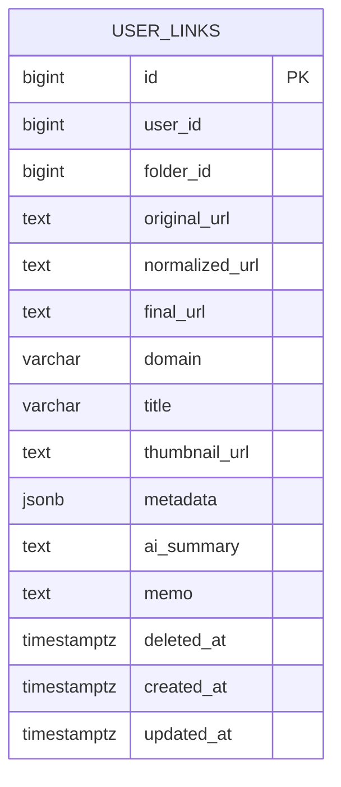

# user_links

사용자가 저장한 링크의 URL, 수집 메타데이터, AI 요약, 사용자별 상태를 함께 저장하는 테이블이다. 같은 URL을 여러 사용자가 저장해도 사용자 저장 링크 행은 독립적으로 생성한다.

## ERD



## 필드

| 필드 | 타입 | 필수 | 설명 |
| --- | --- | --- | --- |
| id | bigint | Y | 사용자 저장 링크 식별자 |
| user_id | bigint | Y | 링크를 저장한 회원 ID |
| folder_id | bigint | N | 저장된 커스텀 폴더 ID. `NULL`이면 미분류 |
| original_url | text | Y | 사용자가 저장을 요청한 원본 URL |
| normalized_url | text | Y | 사용자별 중복 저장 판단에 사용하는 정규화 URL |
| final_url | text | N | redirect 이후 최종 URL |
| domain | varchar | N | 출처 표시와 검색에 사용하는 도메인 |
| title | varchar | N | 수집된 제목. 수집 실패 시 `NULL` 가능 |
| thumbnail_url | text | N | 수집된 대표 이미지 URL |
| metadata | jsonb | N | Open Graph, favicon, description 등 확장 메타데이터 |
| ai_summary | text | N | AI 요약 결과 |
| memo | text | N | 사용자 메모. 최대 500자 |
| deleted_at | timestamptz | N | 최근 삭제된 항목으로 이동한 일시 |
| created_at | timestamptz | Y | 링크 저장 일시이자 레코드 생성 일시 |
| updated_at | timestamptz | Y | 레코드 수정 일시 |

## 제약

- 동일 URL 중복 저장 방지는 사용자 단위로 처리한다.
- 활성 링크는 `user_id + normalized_url` 기준으로 중복 저장을 막는다.
- 같은 URL이 최근 삭제된 항목에 있을 때 새 저장을 막을지, 새 저장을 허용할지, 복원으로 유도할지는 기획 논의가 필요하다.
- 폴더 미선택 상태와 복원 후 미분류 상태는 `folder_id IS NULL`로 표현한다.
- 링크 저장 최신순 정렬은 `created_at`을 기준으로 한다.
- 영구 삭제 대상은 별도 컬럼 없이 `deleted_at <= now() - interval '30 days'` 조건으로 판단한다.
- 복원 시 `deleted_at`을 `NULL`로 되돌린다.
- 검색 대상은 `title`, `domain`, `original_url`, `final_url`, `ai_summary`, `memo`이며, `deleted_at IS NULL`인 링크만 포함한다.
- AI 요약 시도의 모델, 프롬프트, 토큰, 비용, TTLB, 에러, 생성 요약문은 `ai_summary_metrics`에 저장한다.
- `metadata`는 확장 정보 보관용이며, 목록/검색/정렬에 자주 쓰는 값은 별도 컬럼으로 둔다.

## 인덱스 설계

```sql
CREATE UNIQUE INDEX user_links_user_id_normalized_url_active_idx
  ON user_links (user_id, normalized_url)
  WHERE deleted_at IS NULL;

CREATE INDEX user_links_user_id_created_at_idx
  ON user_links (user_id, created_at DESC);

CREATE INDEX user_links_user_id_folder_id_created_at_idx
  ON user_links (user_id, folder_id, created_at DESC)
  WHERE deleted_at IS NULL;

CREATE INDEX user_links_user_id_deleted_at_idx
  ON user_links (user_id, deleted_at);

CREATE INDEX user_links_deleted_at_idx
  ON user_links (deleted_at)
  WHERE deleted_at IS NOT NULL;
```

- `user_id + normalized_url`: 사용자별 활성 링크 중복 저장 방지.
- `user_id + created_at`: 내 링크 목록 최신순 조회용.
- `user_id + folder_id + created_at`: 폴더별 링크 목록 조회용.
- `user_id + deleted_at`: 사용자별 최근 삭제된 항목 조회용.
- `deleted_at`: 전체 영구 삭제 배치 대상 조회용.

## 향후 확장

- 사용자가 AI 요약을 직접 수정할 수 있게 되면 원본 AI 요약과 사용자 수정 요약을 분리할지 결정한다.
