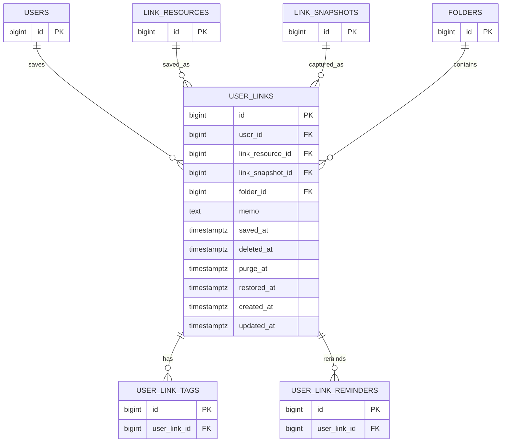

# user_links

사용자가 저장한 링크 테이블이다. 링크 원본과 스냅샷은 `link_resources`, `link_snapshots`에서 관리하고, 이 테이블은 사용자별 폴더, 메모, 삭제 상태, 저장 시점을 관리한다.

## ERD

## 필드

| 필드 | 타입 | 필수 | 설명 |
| --- | --- | --- | --- |
| id | bigint | Y | 사용자 저장 링크 식별자 |
| user_id | bigint | Y | 링크를 저장한 회원 ID |
| link_resource_id | bigint | Y | 정규화 링크 리소스 ID |
| link_snapshot_id | bigint | Y | 사용자가 저장할 때 참조한 링크 스냅샷 ID |
| folder_id | bigint | N | 저장된 커스텀 폴더 ID. `NULL`이면 미분류 |
| memo | text | N | 사용자 메모. 최대 500자 |
| saved_at | timestamptz | Y | 링크 저장 일시. 최신순 정렬 기준 |
| deleted_at | timestamptz | N | 최근 삭제된 항목으로 이동한 일시 |
| purge_at | timestamptz | N | 자동 영구 삭제 예정 일시. `deleted_at + 30일` |
| restored_at | timestamptz | N | 최근 삭제된 항목에서 복원한 일시 |
| created_at | timestamptz | Y | 레코드 생성 일시 |
| updated_at | timestamptz | Y | 레코드 수정 일시 |

## 제약

- 동일 URL 중복 저장 방지는 사용자 단위로 처리한다.
- 활성 링크는 `user_id + link_resource_id` 기준으로 중복 저장을 막는다.
- 같은 URL이 최근 삭제된 항목에 있을 때 새 저장을 막을지, 새 저장을 허용할지, 복원으로 유도할지는 기획 논의가 필요하다.
- 폴더 미선택 상태와 복원 후 미분류 상태는 `folder_id IS NULL`로 표현한다.
- 검색 대상은 연결된 `link_snapshots.title`, `link_snapshots.site_name`, `user_links.memo`이며, `deleted_at IS NULL`인 링크만 포함한다.
- `link_snapshot_id`는 사용자가 저장한 당시의 표시/요약 상태를 보존하기 위해 자동 갱신하지 않는다.

## 향후 확장

- 사용자가 AI 요약을 직접 수정할 수 있게 되면 `user_links`에 사용자별 수정 요약 필드를 추가한다.
- 사용자별 수정 요약은 `link_snapshots.ai_summary`와 달리 공유 스냅샷 데이터가 아니므로 `user_links` 영역에서 관리한다.
