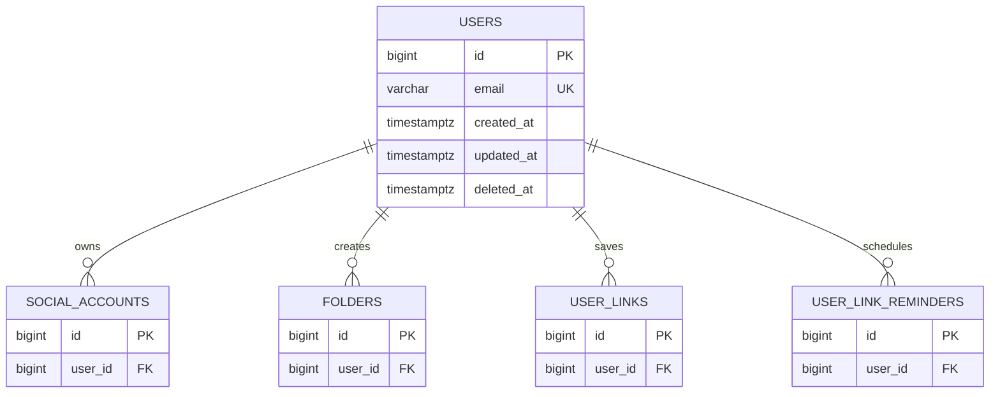

# users

회원 계정의 기준 테이블이다. 설정 화면의 이메일 표시, 회원 탈퇴 처리 시점, 사용자별 링크/폴더 소유권의 기준이 된다.

## ERD

## 필드

| 필드 | 타입 | 필수 | 설명 |
| --- | --- | --- | --- |
| id | bigint | Y | 회원 식별자 |
| email | varchar | Y | 설정 화면에 표시할 대표 이메일 |
| created_at | timestamptz | Y | 회원 생성 일시 |
| updated_at | timestamptz | Y | 회원 정보 수정 일시 |
| deleted_at | timestamptz | N | 회원 탈퇴 또는 소프트 삭제 일시 |

## 제약

- `email`은 대표 이메일 기준으로 유니크하게 관리한다.
- 이메일 미제공 소셜 계정 또는 동일 이메일 계정 병합은 인증 정책에서 결정한다.
