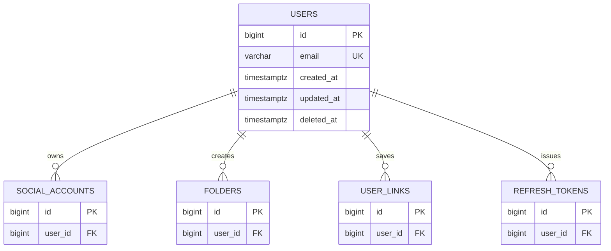

# users

회원 계정의 기준 테이블이다. 설정 화면의 이메일 표시, 회원 탈퇴 처리 시점, 사용자별 링크/폴더 소유권의 기준이 된다.

## ERD

```mermaid
erDiagram
  USERS ||--o{ SOCIAL_ACCOUNTS : owns
  USERS ||--o{ FOLDERS : creates
  USERS ||--o{ USER_LINKS : saves
  USERS ||--o{ REFRESH_TOKENS : issues

  USERS {
    bigint id PK
    varchar email UK
    timestamptz created_at
    timestamptz updated_at
    timestamptz deleted_at
  }

  SOCIAL_ACCOUNTS {
    bigint id PK
    bigint user_id FK
  }

  FOLDERS {
    bigint id PK
    bigint user_id FK
  }

  USER_LINKS {
    bigint id PK
    bigint user_id FK
  }

  REFRESH_TOKENS {
    bigint id PK
    bigint user_id FK
  }
```

## 필드

| 필드 | 타입 | 필수 | 설명 |
| --- | --- | --- | --- |
| id | bigint | Y | 회원 식별자 |
| email | varchar | Y | 설정 화면에 표시할 대표 이메일 |
| created_at | timestamptz | Y | 회원 생성 일시 |
| updated_at | timestamptz | Y | 회원 정보 수정 일시 |
| deleted_at | timestamptz | N | 회원 탈퇴 또는 소프트 삭제 일시 |

## 제약

- `email`은 활성 회원(`deleted_at IS NULL`) 범위에서만 유니크하다(`users_email_active_unique`, partial unique index). 탈퇴한 회원은 이메일을 그대로 남겨두므로, 전역 유니크로 두면 같은 이메일로 재가입하는 INSERT가 항상 제약 위반으로 실패한다.
- 서로 다른 provider가 같은 이메일로 로그인을 시도해도 계정을 자동으로 병합하지 않는다. 이메일 소유를 검증해주지 않는 provider(Kakao 등)가 있어, 병합을 허용하면 남의 이메일을 자칭해 계정을 탈취할 수 있기 때문이다. 이 경우 `409 EMAIL_ALREADY_REGISTERED`를 반환하고, 원래 가입한 provider로 로그인하도록 안내한다.
