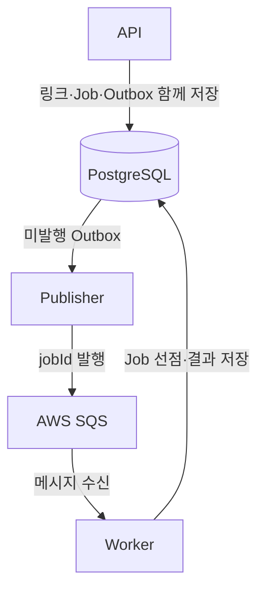
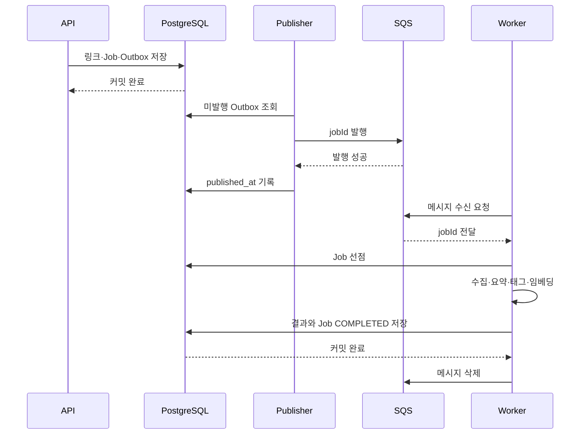
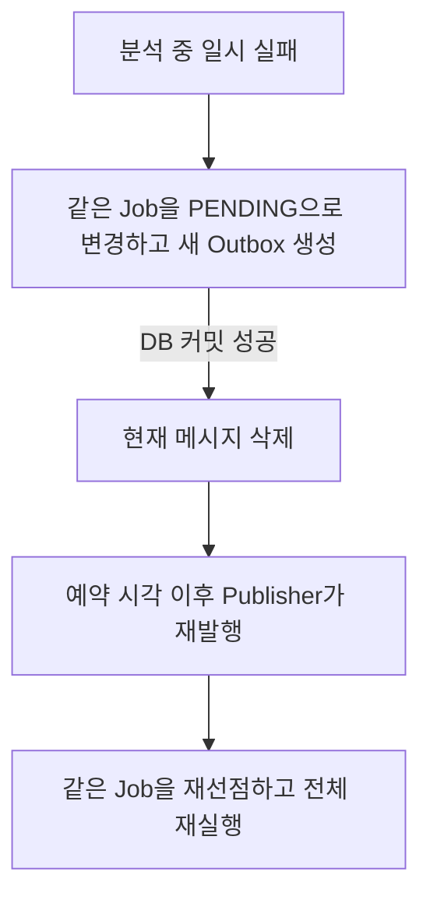
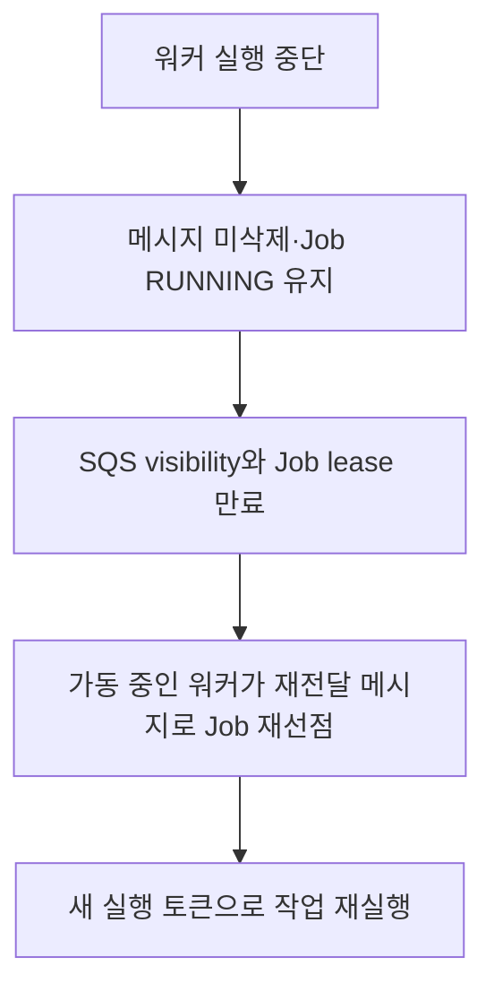

# 링크 분석 워커 설계 및 운영

링크 저장과 분석 실행을 분리하고, 분석 요청의 전달·재시도·결과 저장을 관리하는 구조다. 워커가 수집·요약·태그·임베딩을 수행한다.

## 목차

1. [배경](#1-배경)
2. [구성 요소와 역할](#2-구성-요소와-역할)
3. [정상 처리 흐름](#3-정상-처리-흐름)
4. [장애 복구와 중복 실행 제어](#4-장애-복구와-중복-실행-제어)
5. [데이터 모델과 코드 구조](#5-데이터-모델과-코드-구조)
6. [실행 설정과 워커 전환](#6-실행-설정과-워커-전환)
7. [운영 유의사항](#7-운영-유의사항)

## 1. 배경

링크 저장은 DB 작업이지만 분석은 외부 사이트와 AI 응답을 기다리는 작업이다. 분석 중 오류나 프로세스 종료가 발생해도 저장된 요청을 다시 처리할 수 있어야 한다.

기존에는 API 프로세스에서 최초 분석을 실행하고 실패한 단계만 SQS로 재시도했다. 현재는 최초 요청부터 **Job·Outbox에 기록하고 SQS를 통해 워커에 전달**한다.

| 해결할 문제 | 적용한 방법 |
| --- | --- |
| 링크만 저장되고 분석 요청 전달에 실패 | 링크·Job·Outbox를 같은 트랜잭션으로 저장 |
| 분석 도중 프로세스 종료 | 메시지 재전달과 실행 만료 후 재선점 |
| 중복 메시지와 이전 실행의 늦은 저장 | Job 상태·실행 토큰 검사 |
| API와 분석 처리의 실행 환경 분리 | 독립 워커 진입점과 공통 분석 모듈 |

기존 수집 방식과 AI 로직은 유지한다. 이 구조가 담당하는 범위는 작업 전달과 실행 관리다.

## 2. 구성 요소와 역할

### 전체 구조



이 그림의 화살표는 데이터 흐름이다. Publisher가 DB를 조회하고, Worker가 SQS에서 메시지를 가져온다.

| 구성 요소 | 역할 | 실행·저장 위치 |
| --- | --- | --- |
| **Worker** | 수집·요약·태그·임베딩 실행 | API 프로세스 내부 또는 독립 프로세스 |
| **SQS** | 실행 요청을 대기시키고 워커에 전달 | AWS 메시지 큐 |
| **Job** | 대상 작업의 상태·횟수·실행 권한 기록 | PostgreSQL `link_processing_jobs` |
| **Outbox** | SQS로 발행할 요청 기록 | PostgreSQL `link_analysis_outbox` |
| **Publisher** | 미발행 Outbox를 조회해 SQS로 전송 | API 프로세스 |

### Worker와 SQS

Worker는 실제 작업을 수행하는 프로그램이다. 워커 내부의 **Consumer**가 메시지를 받고, **분석 실행기**가 수집과 AI 호출을 수행한다.

SQS는 워커에 처리 요청을 전달한다. 메시지는 다음처럼 Job ID만 포함하며, URL·사용자·결과는 DB에서 관리한다.

```json
{ "version": 3, "jobId": 123 }
```

메시지가 다시 전달될 수 있으므로 Consumer는 Job 상태를 확인한 뒤 실행한다. 이미 종료된 Job이면 분석을 반복하지 않고 메시지만 삭제한다.

### Job과 Outbox

**Job은 작업의 처리 상태, Outbox는 요청의 발행 상태를 기록한다.**

| 확인 대상 | 기준 |
| --- | --- |
| SQS 발행 완료 여부 | Outbox의 `published_at` |
| 분석 작업 완료 여부 | Job의 `status` |

DB 저장과 SQS 전송은 서로 다른 시스템의 작업이다. 링크를 저장한 직후 전송에 실패하면 분석 요청이 빠질 수 있다. 이를 막기 위해 **링크·Job·Outbox를 한 트랜잭션으로 저장**한다. 하나라도 실패하면 전체가 롤백된다.

Publisher는 이후 Outbox를 읽어 전송한다. 전송 실패 시 미발행 기록이 남아 다시 시도할 수 있다. 발행이 끝나도 분석은 아직 진행 중일 수 있으므로, 실행 완료·재시도·중복 처리는 Job으로 관리한다.

## 3. 정상 처리 흐름

### 저장부터 완료까지



1. **요청 저장:** API는 링크·Job·Outbox가 커밋되면 사용자에게 응답한다. 분석 완료를 기다리지 않는다.
2. **요청 발행:** Publisher는 SQS 전송 성공 후 Outbox에 발행 완료를 기록한다.
3. **Job 선점:** Consumer는 실행 가능한 Job을 `RUNNING`으로 바꾸고 횟수·실행 토큰·만료 시간을 기록한다.
4. **분석 실행:** 수집과 AI 호출은 DB 트랜잭션 밖에서 수행한다.
5. **결과 확정:** 실행 권한을 다시 확인하고 결과와 Job 상태를 함께 저장한다.
6. **메시지 삭제:** DB 커밋 후 SQS 메시지를 삭제한다. 이 문서에서는 이를 **ACK**라고 부른다.

같은 링크의 Job은 앞선 작업부터 처리한다. 앞선 Job이 끝나기 전에는 후속 Outbox 발행을 보류하며, 다른 링크들은 여러 워커가 병렬로 처리할 수 있다.

### 작업 종류

| 종류 | 생성 시점 | 실행 내용 |
| --- | --- | --- |
| `ANALYZE` | 링크 생성 | 수집 → 요약·태그 병렬 생성 → 임베딩 |
| `EMBEDDING` | 메모 수정 | 최신 DB 입력으로 임베딩만 생성 |

현재 임베딩 입력은 **제목·태그·요약**이다. 메모 수정 시 임베딩을 요청하는 기존 동작은 유지하지만, 메모 자체는 입력에 포함되지 않는다. 저장 전 preview API도 기존 처리 방식을 유지한다.

### 결과 상태와 API 호환성

분석 결과는 해당 실행의 최종 확정 시점에 저장한다. 일시 실패로 재시도를 예약할 때는 중간 결과를 저장하지 않는다. 최종 실패에서는 확정 가능한 결과와 `FAILED`를 함께 저장한다.

기존 API 필드와 요약 상태의 의미는 유지한다. `processingStatus`는 `links.ai_summary_status`, 즉 **요약 상태**이며 전체 Job 상태와 다르다. 최종 실행에서 요약은 성공하고 임베딩은 실패했다면 요약은 `SUCCESS`, Job은 `FAILED`일 수 있다.

## 4. 장애 복구와 중복 실행 제어

### 일시 실패와 재시도



**재시도에서는 Job 행을 유지하고 Outbox 행을 새로 만든다.** 최초 실행과 재시도는 같은 큐를 사용하며, 분석 단계 사이에 별도 큐를 두지 않는다.

실행은 총 4회, 일시 실패 간격은 60/120/240초다. `ANALYZE`는 실패한 단계와 관계없이 수집부터 다시 실행하므로 AI 호출 비용이 반복될 수 있다. 재시도 예약을 DB에 저장하지 못하면 현재 메시지를 삭제하지 않는다.

### 워커 중단과 재전달



- **SQS visibility timeout:** 수신한 메시지를 일정 시간 숨긴다. 삭제되지 않은 메시지는 시간이 지나면 다시 받을 수 있다.
- **Job lease:** 현재 실행 권한의 유효 시간이다. 만료된 Job은 다른 실행이 다시 선점할 수 있다.

| 구분 | 설정 | 목적 |
| --- | --- | --- |
| 전체 실행 제한 | 180초 | 장시간 분석 중단 |
| Job lease | 240초 | 중단된 실행의 권한 만료 |
| SQS visibility | 기본 300초 | 미삭제 메시지 재전달 |

`180 < 240 < 300` 순서로 설정하며 visibility가 240초 이하이면 Consumer가 시작을 거부한다. 실제 복구 시점은 남은 대기 시간과 워커 가동 여부에 따라 달라진다. 워커 프로세스를 자동으로 켜는 기능은 없다.

### 중복 실행과 저장 보호

선점할 때마다 `execution_token`을 새로 발급한다. 저장 시 **RUNNING 상태·토큰 일치·lease 유효성**을 검사한다. 이전 실행이 늦게 끝나더라도 새 실행의 결과를 덮어쓸 수 없게 한다.

| 상황 | 처리 |
| --- | --- |
| SQS 발행 성공 후 Outbox 기록 실패 | 중복 발행 가능. Job 상태와 토큰으로 처리 제어 |
| 결과 또는 재시도 예약 저장 실패 | 전체 롤백, 메시지 미삭제 |
| 결과 저장 후 메시지 삭제 실패 | 재수신 시 종료된 Job 확인 후 메시지만 삭제 |
| 실행 토큰 상실 | 결과·실패·재시도 저장을 거부하고 메시지도 미삭제 |
| 대상 링크 삭제 | 결과를 반영하지 않고 Job CANCELLED 처리 |

이 제어는 DB 결과 반영을 보호한다. 외부 AI 호출이 정확히 한 번만 발생하거나 이미 시작된 호출이 즉시 취소되는 것까지 보장하지는 않는다.

### DLQ — 처리하지 못한 메시지의 보관 큐

**DLQ는 PostgreSQL 테이블이 아니라 AWS SQS에 만든 별도 큐다.** 메시지를 반복 수신해도 처리·삭제하지 못하면 SQS가 DLQ로 옮긴다. 잘못된 메시지 형식이나 장기 DB 장애가 대표적인 경우다.

| 저장 대상 | 위치 | 보관 기간 |
| --- | --- | --- |
| 일반 작업 메시지 | SQS `promise9-link-analysis` | 4일 |
| 반복 처리 실패 메시지 | SQS `promise9-link-analysis-dlq` | 14일 |
| Job 상태·오류 기록 | PostgreSQL `link_processing_jobs` | SQS 보관 기간과 별개 |

SQS의 `maxReceiveCount`는 10이며, 수신 횟수는 실제 Job 실행 횟수와 다르다. **Job FAILED와 DLQ 이동은 별개**다. 원인을 해결한 뒤 운영자가 DLQ 메시지를 원래 큐로 돌려보내며, 자동 복구 로직은 없다.

## 5. 데이터 모델과 코드 구조

### Job 테이블

`link_processing_jobs`의 한 행은 하나의 논리 작업이다.

| 필드 | 역할 |
| --- | --- |
| `id`, `link_id`, `user_id` | 작업·대상 링크·소유자 식별 |
| `job_type` | ANALYZE / EMBEDDING |
| `status` | PENDING / RUNNING / COMPLETED / FAILED / CANCELLED |
| `attempt_count` | 실제 선점 횟수 |
| `next_attempt_at` | 재실행 가능 시각. 오래된 메시지의 조기 실행 차단 |
| `execution_token`, `lease_expires_at` | 현재 실행 권한과 만료 시각 |
| `last_error_code`, `last_error_message` | 실패 분류와 설명. 외부 오류 원문은 저장하지 않음 |
| `created_at`, `updated_at`, `finished_at` | 생성·갱신·종료 시각 |

`(link_id, user_id)` 복합 FK로 링크 소유자 정합성을 유지한다. 활성 Job 조회 인덱스와 링크당 RUNNING 하나만 허용하는 UNIQUE 인덱스가 있다. 워커 등록 정보는 저장하지 않는다.

### Outbox 테이블

| 필드 | 역할 |
| --- | --- |
| `id`, `job_id` | 발행 요청과 대상 Job 식별 |
| `available_at` | 발행 가능 시각 |
| `published_at` | 발행 성공 시각. NULL이면 미발행 |
| `created_at` | 요청 생성 시각 |

`link_analysis_outbox`는 미발행 요청을 조회하는 부분 인덱스를 사용한다. 재시도 시 `available_at`과 Job의 `next_attempt_at`은 같은 값으로 기록한다. 기존 `links`, `tags` 컬럼은 유지한다.

### 파일별 책임

아래 경로는 `src/modules/link/` 기준이다.

| 파일 | 책임 |
| --- | --- |
| `link.service.ts` | 요청 처리와 기존 API 응답 구성 |
| `link.repository.ts` | 링크 변경과 Job·Outbox 생성 트랜잭션 |
| `analysis/link-job.schema.ts` | Job·Outbox 테이블과 DB 제약 |
| `analysis/link-job.repository.ts` | 선점, 실행 권한 검사, 결과 저장, 재시도 예약 |
| `analysis/link-outbox.repository.ts` | 발행 대상 잠금과 발행 완료 저장 |
| `analysis/link-analysis.publisher.ts` | Outbox 폴링과 SQS 발행 |
| `analysis/link-analysis.consumer.ts` | SQS 수신, 실행 제한, 처리 후 메시지 삭제 |
| `analysis/link-analysis.service.ts` | 수집·AI 실행과 결과 반환 |
| `analysis/link-analysis.module.ts` | Consumer·실행기·수집기 의존성 구성 |

`src/worker.ts`와 `src/worker.module.ts`는 독립 워커 진입점이다. `src/infrastructure/sqs/`는 AWS SDK 호출을 담당한다. 수집기와 실행기는 provider token으로 주입해 큐·Job 처리와 구현을 분리한다.

Publisher는 `FOR UPDATE SKIP LOCKED`로 한 Outbox를 잠그고 10초 제한으로 발행한다. Job 선점·결과 저장은 링크 행 → Job 행 순서로 잠근다.

## 6. 실행 설정과 워커 전환

### 실행 방식

| 방식 | API 프로세스 | 독립 워커 |
| --- | --- | --- |
| API와 함께 처리 | Publisher·Consumer 실행 | 중지 |
| 독립 워커에서 처리 | Publisher만 실행 | Consumer 실행 |

```bash
bun run build
bun run start:prod       # API 실행
bun run start:worker     # 독립 워커 실행
```

각 Consumer는 메시지를 하나씩 처리한다. 여러 Consumer를 켜면 경쟁 소비하며 우선순위를 두지 않는다. 독립 워커를 사용할 때도 **API의 Publisher는 계속 필요하다.**

### 주요 설정

| 설정 | 동작 |
| --- | --- |
| `APP_ENV`, 해당 `DATABASE_URL_*` | 실행 환경과 DB 연결 |
| `SQS_LINK_ANALYSIS_QUEUE_URL` | Publisher·Consumer가 공유할 큐 |
| `SQS_CONSUMER_ENABLED` | API 기본 false. 독립 워커는 true 필수 |
| `AWS_REGION`, AWS 자격 증명 | SQS 접근 |
| `OPENAI_API_KEY` | production 필수, 임베딩 호출에 사용 |
| `GEMINI_API_KEY`, `TINY_FISH_API_KEY` | 해당 제공자 사용 시 설정 |
| `SQS_WAIT_TIME_SECONDS` | long polling 대기, 기본 20초 |
| `SQS_VISIBILITY_TIMEOUT_SECONDS` | 기본 300초, 240초보다 크게 설정 |
| `SQS_ENDPOINT` | 개발용 SQS 호환 엔드포인트 |

독립 워커는 JWT·OAuth·이메일 설정을 요구하지 않는다. 큐 URL이 없으면 API의 Outbox는 DB에 대기하며, Consumer는 큐 URL 없이 켤 수 없다.

### 전환과 종료

1. 기존 Consumer를 중단한다. API 내부 Consumer라면 `SQS_CONSUMER_ENABLED=false`로 재시작하며 Publisher는 유지한다.
2. 기존 프로세스의 진행 중인 실행이 정리될 때까지 기다린다.
3. 같은 DB·큐를 사용하는 대상 프로세스에서 `SQS_CONSUMER_ENABLED=true`로 실행한다.

환경변수는 시작 시 읽는다. 정상 종료에서는 새 수신을 중단하고 현재 실행을 정리한 뒤 DB·SQS 연결을 닫는다. API 컨테이너 종료 유예는 4분이다.

배포 워크플로는 GitHub Repository Variable `SQS_CONSUMER_ENABLED`를 사용하며, 미설정 시 true다. 독립 워커만 사용하려면 false로 지정해 이후 배포에서도 서버 소비가 켜지지 않게 한다.

## 7. 운영 유의사항

- **메시지 버전:** 기존 v2와 현재 v3는 호환되지 않는다. 전환 전에 기존 큐·DLQ를 정리하거나 큐를 분리해야 한다.
- **배포 순서:** 마이그레이션 `0013`, `0014`와 SQS·IAM 변경을 적용한 뒤 새 API·워커를 실행한다. 운영 적용은 별도 수행 대상이다.
- **권한:** 런타임은 해당 큐의 SendMessage·ReceiveMessage·DeleteMessage·ChangeMessageVisibility를 사용한다. [런타임 권한 정책](../infrastructure/access.md)을 따른다.
- **환경 분리:** development에서 운영 큐에 직접 발행·소비하는 것을 차단한다.
- **관측:** 미발행 Outbox, 오래 대기한 Job, 만료된 RUNNING, FAILED, DLQ 적체를 함께 확인한다.
- **복구 범위:** DLQ·메시지 보관 기간 만료·FAILED 작업의 재실행은 자동 처리하지 않는다. 앞선 Job이 멈추면 같은 링크의 후속 Job도 대기할 수 있다.
