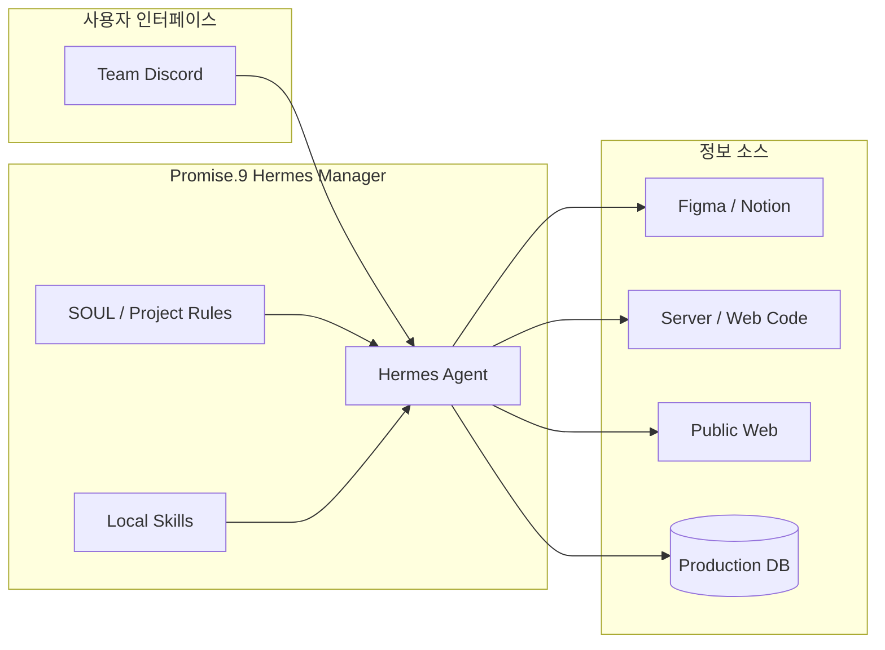
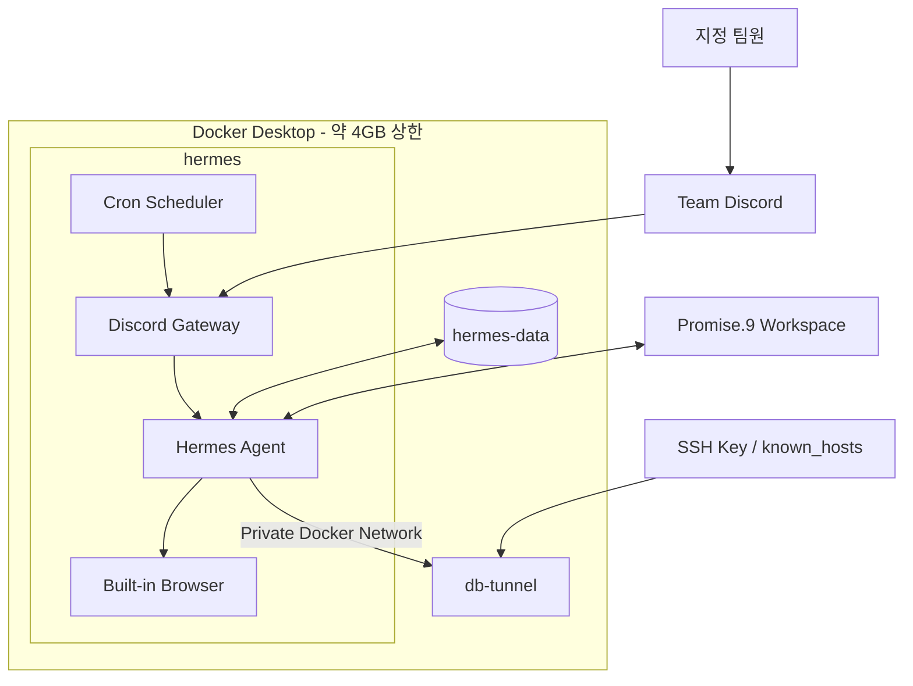
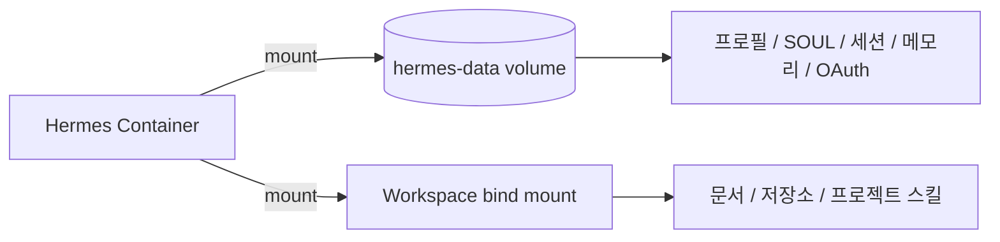
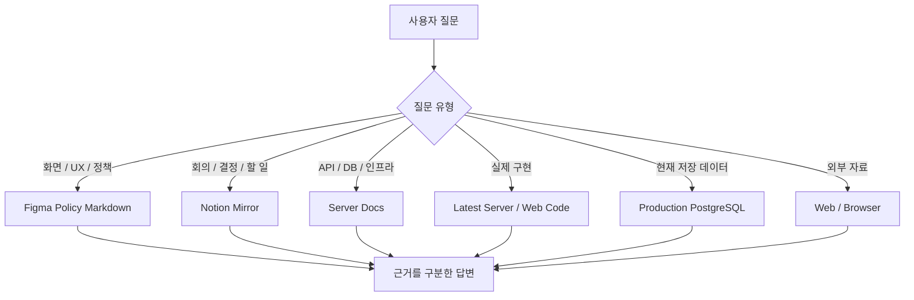
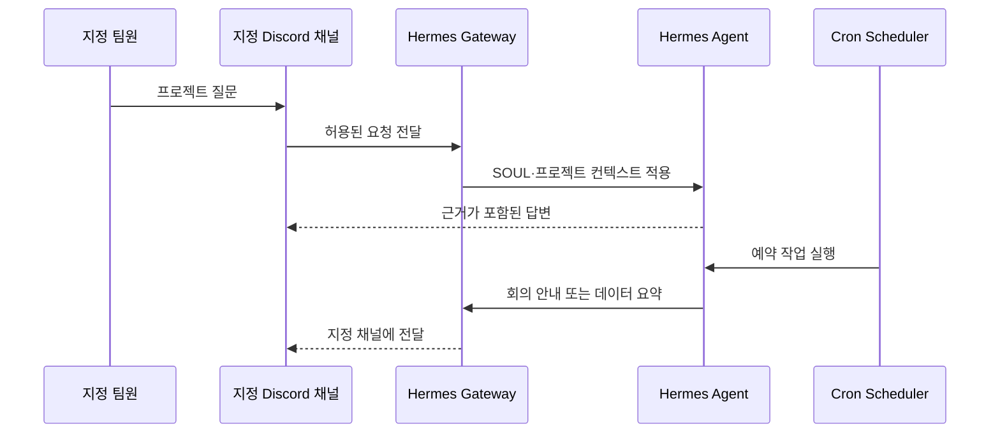
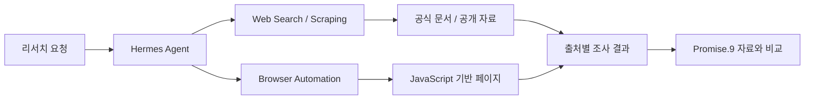
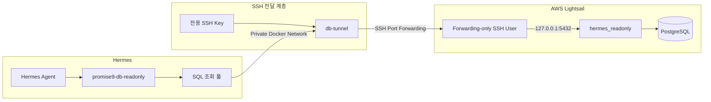

# Promise.9 Hermes Manager

Promise.9의 제품 정책, 회의 기록, 코드와 운영 데이터를 한곳에서 조회하는 프로젝트 전용 AI 매니저다.

팀 Discord에서 사용할 수 있다. 질문의 목적에 따라 Figma, Notion, Git 저장소, 운영 PostgreSQL 또는 공개 웹을 선택하고, 서로 다른 출처의 내용을 구분해서 답한다.

## 한눈에 보기

| 영역 | 구성 |
|---|---|
| 실행 환경 | MacBook, Docker Compose, 약 4GB 메모리 상한 |
| 사용자 접점 | 팀 Discord 지정 채널 |
| 프로젝트 지식 | Figma, Notion, Server/Web 문서와 코드 |
| 외부 조사 | Hermes 내장 Web/Browser 도구 |
| 운영 데이터 | SSH 터널, PostgreSQL 읽기 전용(`read-only`) 계정 |
| 자동화 | Cron 스케줄러, Discord 결과 전달 |
| 상태 보존 | Docker volume, workspace bind mount |
| LLM 인증 | OAuth, Compose API Key 없음 |

---

## 1. 전체 구성

전체 시스템은 사용자 인터페이스, Hermes 매니저, 정보 소스의 세 영역으로 나뉜다.



Hermes는 모든 자료를 한꺼번에 읽지 않는다. 질문을 먼저 분류한 뒤 필요한 출처와 스킬만 선택한다.

### 주요 기능

- Figma 정책과 화면 정보 조회
- Notion 회의 기록, 의사결정과 할 일 조회
- 프론트엔드·백엔드 문서 및 최신 코드 확인
- 운영 PostgreSQL 데이터 읽기 전용 조회
- 팀 Discord 질의응답
- 회의 안내와 정기 데이터 요약 예약
- 내장 브라우저를 통한 웹 리서치
- 프로젝트 프로필, 메모리와 세션 유지

---

## 2. Docker 실행 구조

Hermes와 DB 터널은 역할이 다른 별도 컨테이너로 실행한다.



### Hermes 컨테이너

| 항목 | 설정 |
|---|---|
| 작업 경로 | `/opt/data/workspace` |
| 재시작 정책 | `unless-stopped` |
| 보안 옵션 | `no-new-privileges` |
| LLM 인증 | OAuth |
| API Key | Compose 환경변수에 저장하지 않음 |

Hermes는 지정된 Promise.9 작업공간을 읽고 수정할 수 있지만 호스트 전체 파일이나 Chrome 프로필·쿠키에는 접근할 수 없다.

### 안정성과 리소스

- Docker Desktop 전체 메모리 상한을 약 4GB로 설정했다.
- `restart: unless-stopped`로 Docker 재시작 후 서비스를 복구한다.
- DB 터널 health check가 통과한 뒤 Hermes를 시작한다.
- 컨테이너 supervisor가 Discord 메시징 게이트웨이를 관리한다.
- 터널 연결과 실제 PostgreSQL 연결의 생명주기를 분리한다.

### 데이터 영속성



| 저장 위치 | 유지하는 데이터 |
|---|---|
| `hermes-data` volume | 프로필, SOUL, 세션, 메모리, OAuth, Discord 설정 |
| Workspace bind mount | Figma·Notion 자료, Git 저장소, 프로젝트 로컬 스킬 |

컨테이너 이미지와 데이터를 분리했기 때문에 컨테이너를 중지하거나 재생성해도 매니저 상태와 프로젝트 자료가 유지된다.

---

## 3. 프로젝트 지식 탐색

Hermes의 영속 `SOUL.md`에는 Promise.9 프로젝트 매니저 역할과 기본 행동 원칙이 저장되어 있다. 세부 출처와 탐색 순서는 `PROMISE9.md`와 각 저장소의 인덱스가 담당한다.



### 출처별 역할

| 질문 유형 | 우선 확인하는 자료 | 해석 방식 |
|---|---|---|
| 제품 화면, UX, 문구, 정책 | Figma 정책 Markdown | 현재 제품 기준 |
| API, DB, 인프라, 검색, 배포 | `Promise.9-Server/docs/` | 문서화된 서버 동작 |
| 실제 구현 상태 | 최신 Server/Web 코드 | 현재 코드 기준 |
| 회의, 의사결정, 할 일 | Notion Mirror | 배경과 히스토리 |
| 저장 데이터와 통계 | 운영 PostgreSQL | 현재 운영 상태 |
| 외부 기술·시장 자료 | Web/Browser | 외부 조사 결과 |

자료가 충돌하면 하나로 임의 병합하지 않는다. 제품 정책, 문서화된 동작, 실제 구현, 운영 데이터와 결정 배경을 나눠 설명한다.

### Figma

- 현재 화면과 제품 정책의 우선 기준
- 정책 텍스트를 기능별 Markdown으로 관리
- 화면, 흐름과 정책 인덱스를 분리
- 이미지보다 추출된 정책 텍스트를 먼저 확인

### Notion

- 회의 원본과 정리 문서를 분리
- 의사결정, 할 일, 담당자와 일정 관리
- 현재 정책보다 결정 배경과 변경 히스토리 확인에 사용

### Git 저장소

작업공간에는 `Promise.9-Server`와 `Promise.9-Web`이 있다. 코드나 Git 이력을 근거로 답하기 전에는 원격 `main`을 동기화한다.

```bash
git status --short --branch
git fetch origin main
git pull --ff-only origin main
```

다음 조건을 모두 만족할 때만 pull한다.

- 현재 브랜치가 `main`
- working tree가 깨끗함
- merge 또는 rebase가 진행 중이지 않음
- 인증과 네트워크 연결이 정상임

조건을 만족하지 않으면 stash, reset, checkout으로 우회하지 않고 현재 상태를 보고한다.

---

## 4. Discord와 예약 작업

Discord 메시지와 예약 작업은 동일한 Hermes Agent로 전달된다. 두 경로 모두 같은 SOUL, 프로젝트 자료, 스킬과 DB 권한을 사용한다.



### Discord 접근 범위

- 지정된 Discord 서버와 채널에서만 사용
- 사전에 허용한 팀원만 요청 가능
- 모든 Discord 요청에 동일한 프로젝트 규칙 적용
- 운영 DB 조회에도 동일한 읽기 전용 권한 적용
- 메시징 게이트웨이는 컨테이너 supervisor가 관리

### Cron 스케줄러로 가능한 작업

- 회의 전날 또는 회의 시작 전 일정 안내
- 회의 준비사항과 관련 문서 전달
- 매일 오전 9시 전날 저장 데이터 요약
- 신규 링크, 리마인드와 주요 운영 지표 집계
- 주간 미완료 action item과 담당자 정리
- Figma 정책과 코드 변경사항 점검

예약 작업은 SOUL, 프로젝트 자료와 로컬 스킬을 동일하게 사용한다. 실행 기록과 작업별 notepad도 영속화할 수 있다.

현재 cron 스케줄러는 사용할 수 있지만 활성 작업은 등록되어 있지 않다.

---

## 5. 내장 브라우저와 웹 리서치

Hermes의 `web` 검색·스크래핑 도구와 `browser` 자동화 도구가 활성화되어 있다.



### 가능한 작업

- 공식 문서와 기술 자료 검색
- 경쟁 서비스 및 시장 사례 조사
- 공개 웹페이지의 콘텐츠와 구조 확인
- JavaScript 렌더링이 필요한 페이지 탐색
- 웹 자료와 Promise.9 내부 문서 비교
- 조사 결과를 출처별로 정리

내장 브라우저는 호스트 Chrome 프로필, 쿠키와 로그인 세션을 공유하지 않는다. 공개 페이지는 바로 조사할 수 있지만 인증이 필요한 서비스에는 별도 연결이 필요하다.

---

## 6. 운영 DB 읽기 전용 조회

운영 DB 접근은 SSH 전달 계층, PostgreSQL 권한 계층, Hermes 조회 스킬의 세 단계로 제한한다.



### 1단계: SSH 터널

- `hermes-db-tunnel` 전용 SSH 사용자 사용
- `db-tunnel`만 SSH 개인키와 `known_hosts`를 읽을 수 있음
- Hermes에는 SSH 개인키를 마운트하지 않음
- 원격 셸, 명령 실행, SFTP, TTY와 `sudo` 차단
- PostgreSQL의 `127.0.0.1:5432` 포워딩만 허용
- 터널 포트는 Docker 내부 네트워크에만 노출
- strict host-key checking과 keepalive 적용

`db-tunnel`에는 읽기 전용 root filesystem, 전체 Linux capability 제거와 `no-new-privileges`를 적용한다. 터널 health check가 성공한 뒤에만 Hermes가 시작된다.

SSH 터널은 컨테이너 실행 중 유지하고, 실제 PostgreSQL 연결은 쿼리마다 생성한 뒤 결과 반환 후 종료한다.

### 2단계: PostgreSQL 권한

운영 애플리케이션 계정과 분리된 `hermes_readonly` 역할을 사용한다.

| 제한 | 설정 |
|---|---|
| 테이블 권한 | 허용 테이블의 `SELECT`만 부여 |
| 쓰기·변경 | `INSERT`, `UPDATE`, `DELETE`, DDL 차단 |
| 운영 명령 | migration, restore 차단 |
| 인증 테이블 | `refresh_tokens`, `social_accounts` 조회 차단 |
| 최대 연결 | 3개 |
| 트랜잭션 | 기본 읽기 전용 |
| Statement timeout | 15초 |
| Lock timeout | 3초 |
| Idle transaction timeout | 30초 |

Hermes에는 DB 비밀번호 파일만 읽기 전용으로 제공된다. 실제 권한 범위는 PostgreSQL의 `GRANT` 설정이 최종적으로 제한한다.

### 3단계: DB 조회 스킬

`promise9-db-readonly`는 운영 데이터 질문을 처리하는 Hermes 로컬 스킬이며 `local / enabled` 상태로 등록되어 있다.

- 전용 SQL 조회 툴만 사용
- `SELECT`, `WITH`, `SHOW`, `EXPLAIN`만 허용
- 읽기 전용 transaction 강제
- 기본 최대 200행, 최대 1,000행
- 기본 query timeout 15초, 최대 60초
- 쿼리 완료 후 DB 연결 종료
- 인증정보와 불필요한 개인정보 조회 금지
- 운영 데이터와 제품 정책을 구분해 보고

프롬프트와 조회 툴은 실수를 방지하고, PostgreSQL 권한은 실제 쓰기와 민감 테이블 접근을 차단한다.

### 접근 범위

| 자원 | Hermes | db-tunnel |
|---|---:|---:|
| Promise.9 작업공간 | 읽기·쓰기 | 접근 불가 |
| Hermes 프로필·메모리 | 읽기·쓰기 | 접근 불가 |
| DB 비밀번호 | 읽기 전용 | 접근 불가 |
| SSH 개인키 | 접근 불가 | 읽기 전용 |
| 호스트 Chrome 프로필·쿠키 | 접근 불가 | 접근 불가 |
| 운영 DB 쓰기 권한 | 없음 | 없음 |
| 호스트 Docker socket | 접근 불가 | 접근 불가 |

자격 증명 파일은 Git 저장소와 Hermes 작업공간 밖에 보관한다.

---

## 7. 사용 예시

### 정책과 회의 기록

```text
현재 검색 정책을 Figma 기준으로 정리해줘.

최근 회의에서 폴더 삭제 정책이 어떻게 결정됐는지 알려줘.

Figma 정책과 Notion 결정 기록이 다른 부분을 구분해줘.
```

### 코드

```text
백엔드 main을 최신화한 뒤 검색 API의 실제 구현 상태를 확인해줘.

프론트엔드와 백엔드의 링크 응답 타입이 일치하는지 확인해줘.
```

### 운영 DB

```text
운영 DB에서 현재 저장된 링크 개수를 조회해줘.

최근 7일간 저장된 링크 수를 날짜별로 집계해줘.

폴더별 링크 개수 상위 10개를 개인정보 없이 조회해줘.
```

### 리서치와 자동화

```text
공식 문서를 찾아 현재 사용 중인 기술과 비교해줘.

다음 회의 전에 일정과 준비사항을 Discord에 안내해줘.

매일 오전 9시에 전날 운영 데이터를 요약해서 Discord에 전달해줘.
```
