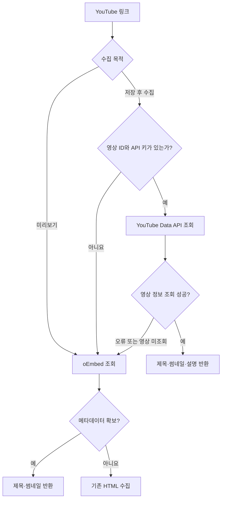

# PR #124: [feat] YouTube 영상 설명 수집 및 미리보기·저장 전략 분리

- URL: https://github.com/mash-up-kr/Promise.9-Server/pull/124
- Author: @vcz-Chan
- Base: main
- Head: feat/youtube-data-api-first
- Merged: 2026-09-09T10:38:04Z

## PR Body

## 📌 개요

YouTube 링크를 저장한 뒤 공식 Data API 한 번으로 제목·썸네일·영상 설명을 수집합니다. 기존에는 oEmbed가 성공하면 제목·썸네일만 반환해, 영상 설명을 저장하거나 AI 분석에 사용할 수 없었습니다.

**이 변경의 목적은 속도 개선보다 AI 분석과 검색에 사용할 영상 설명을 확보하는 것입니다.** 설명이 필요 없는 저장 전 미리보기는 기존 oEmbed 방식을 유지해 Data API 할당량과 대기를 추가하지 않습니다.

| 구분 | 기존 | 변경 후 |
| --- | --- | --- |
| 미리보기 | oEmbed → HTML | 기존 유지, Data API 호출 없음 |
| 저장 후 수집 | oEmbed → HTML | Data API → oEmbed → HTML |
| 저장 후 확보하는 정보 | 제목·썸네일 | 제목·썸네일·영상 설명 |
| 정상 경로의 외부 요청 | 1회 | 1회 |
| 미리보기+저장의 Data API 소모량 | 0 units | 1 unit |

기존 `purpose` 값으로 미리보기와 분석을 구분해 YouTube 전략 안에서 호출 순서를 결정합니다. 일반 영상, `youtu.be` 공유 링크, Shorts, embed, live 경로에서 영상 ID를 추출합니다.

## 🔍 수집 흐름

`LinkContentService`가 수집 순서와 결과 구성을 담당하고, 새 `YoutubeDataClient`가 공식 API 요청과 응답 검증을 담당합니다. 사이트 전략은 URL에서 영상 ID를 추출하고 oEmbed 요청 정보를 제공합니다.

**미리보기는 oEmbed 실패 시에도 Data API를 호출하지 않고 기존 HTML로 넘어갑니다.** 저장 후 수집은 Data API에서 영상 정보를 얻으면 추가 요청 없이 종료합니다. 설명이나 이미지가 없는 정상 응답도 해당 필드를 `null`로 반환하며, 누락된 필드를 채우기 위한 추가 조회는 하지 않습니다.

저장 후 썸네일은 API가 제공한 후보 중 `maxres → standard → high → medium → default` 순서로 선택합니다. 선택한 이미지에는 기존 공개 URL 검증을 적용합니다. 미리보기는 oEmbed 썸네일을 사용하므로, 저장 후에는 더 높은 해상도의 이미지로 달라질 수 있습니다.

## 📝 영상 설명의 저장과 AI 활용

YouTube 설명란을 기존 `description` 필드로 전달합니다. 별도의 영상 본문·자막 수집은 추가하지 않습니다.

| 사용처 | 처리 |
| --- | --- |
| 저장 전 미리보기 | 기존 응답대로 제목·썸네일·출처만 반환 |
| DB 저장 | `metadata.description`에 최대 2,000자 저장 |
| AI 요약·태그 | 같은 설명을 AI 입력의 `description`으로 전달 |
| 키워드 검색 | 저장된 `metadata.description`을 기존 검색에 활용 |
| `content` | YouTube는 HTML 폴백을 포함해 `null`로 유지 |

**설명은 한 번만 AI에 전달하고, 검색에 사용할 원문도 DB에 남깁니다.** 같은 글을 `content`에 중복해서 넣지 않으며, YouTube HTML의 메뉴·추천 영상 문구를 영상 본문으로 사용하지 않습니다.

## 🛠️ 실패 시 처리

아래 API 폴백은 **저장 후 수집**에 적용합니다. 미리보기는 기존 oEmbed → HTML 경로를 사용해 Data API 장애·할당량 소진의 영향을 받지 않습니다.

| 상황 | 처리 |
| --- | --- |
| API 키 미설정 또는 영상 ID 추출 불가 | Data API 요청 없이 oEmbed 사용 |
| API에서 영상이 조회되지 않음 | oEmbed로 전환 |
| 인증·할당량 오류, 원격 장애, 잘못된 응답 | oEmbed로 전환 |
| Data API 응답 지연 | 5초 후 요청 중단, oEmbed로 전환 |
| oEmbed도 정보를 반환하지 못함 | 기존 HTML 수집 실행 |
| HTML까지 요청 오류로 실패 | 호출부에 최종 오류 전달, 저장 후 분석은 기존 재시도 정책 적용 |

**폴백이 성공하면 확보한 정보로 처리를 계속합니다.** oEmbed는 설명을 제공하지 않으므로 이 경로에서는 제목·썸네일만 확보할 수 있습니다. Data API 타임아웃 후 폴백에는 기존 대비 약 5초의 대기가 추가될 수 있습니다.

API 응답 크기를 제한하고 구조를 검증합니다. 키가 포함된 요청 URL이나 원격 오류 본문은 애플리케이션 로그·예외에 넣지 않습니다.

## 🔑 API 할당량과 처리 가능한 횟수

**할당량은 API 키별이 아니라 Google Cloud 프로젝트별로 공유합니다.** 같은 프로젝트에서 키를 여러 개 발급해도 총한도가 늘지 않으며, 개발·운영에서 같은 프로젝트의 키를 쓰면 사용량도 합산됩니다. API 키의 ‘제한 없음’ 설정은 키의 사용처 제한에 관한 설정이며, YouTube 호출 할당량을 없애지 않습니다. [Google API 키 문서](https://docs.cloud.google.com/docs/authentication/api-keys)

2026-09-08 공식 문서 기준이며, 실제 프로젝트의 승인된 한도·남은 사용량은 Google Cloud Console의 **YouTube Data API v3 → 할당량 및 시스템 한도**에서 확인해야 합니다.

| 항목 | 기준 |
| --- | --- |
| 이번 `videos.list`가 사용하는 기본 일일 할당량 | 프로젝트당 **10,000 units/일**, 같은 일반 할당량을 쓰는 다른 API 메서드와 공유 |
| `videos.list(part=snippet)` 1회 | **1 unit**으로 제목·썸네일·설명 함께 조회 |
| 미리보기만 실행 | **0 units**, Data API 호출 없음 |
| 저장 후 수집 | **1 unit** |
| 미리보기 후 저장 | oEmbed 1회 + Data API 1회, **링크당 1 unit** |
| 기본 한도에서 가능한 저장 수집 | 약 **10,000회/일**. 미리보기+저장도 같은 Data API 소모량 |
| 초기화 | 매일 미국 태평양 시간 00:00. 한국 시간으로 서머타임 기간 16:00, 그 외 17:00 |

위 처리량은 **이 기능만 사용하고 추가 호출·재시도가 없다는 가정으로 계산한 프로젝트 전체의 최대치**입니다. Data API 할당량만으로 계산한 값이며 oEmbed 자체의 서비스 제한을 의미하지 않습니다. 미리보기만 보고 저장하지 않으면 Data API 할당량을 쓰지 않습니다. 분석 재시도, 테스트와 다른 서비스의 API 사용량은 같은 한도를 소비합니다. Google에 전달된 잘못된 요청도 최소 1 unit이 소모되므로 성공한 저장 수와 할당량 사용량은 같지 않습니다. [호출당 소모량](https://developers.google.com/youtube/v3/docs/videos/list) · [일일 한도와 초기화 기준](https://developers.google.com/youtube/v3/determine_quota_cost)

**unit은 금액이 아니라 호출 할당량의 단위입니다.** 한도 초과 시 `403 quotaExceeded`로 요청이 거부되며, 이 PR은 oEmbed → HTML로 폴백합니다. 자동으로 초과 결제하며 계속 호출하는 방식이 아니며, 더 큰 한도는 YouTube의 할당량 증설·감사 절차로 요청해야 합니다. oEmbed 폴백에서는 영상 설명을 얻지 못합니다. [할당량 초과 오류](https://developers.google.com/youtube/v3/docs/errors) · [증설 절차](https://developers.google.com/youtube/v3/guides/quota_and_compliance_audits)

현재 구현은 한도 소진 여부를 기억해 API 요청을 중단하는 기능은 없습니다. 소진 후에도 새 저장 수집마다 Data API를 먼저 시도하고 실패하면 폴백하므로, 소진 상태에서는 추가 지연이 발생할 수 있습니다.

## ⏱️ 전후 결과와 속도 비교

동일 영상 2개로 기존 `main`과 변경 후 코드를 비교했습니다. 두 영상 모두 제목은 같았습니다. 미리보기 썸네일은 기존 `hqdefault.jpg`를 유지했고, 저장 후에는 API가 제공한 `maxresdefault.jpg`를 선택했습니다. 저장 수집에서 기존에 없던 설명을 각각 84자와 2,000자 확보했습니다.

| 작업 | 이전 중앙값 | 이후 중앙값 | 차이 | 이전 p95 | 이후 p95 |
| --- | ---: | ---: | ---: | ---: | ---: |
| 미리보기 | 83.05ms | 84.10ms | +1.05ms (+1.3%) | 98.8ms | 92.1ms |
| 저장 후 수집 | 83.10ms | 98.45ms | +15.35ms (+18.5%) | 85.8ms | 108.9ms |

**미리보기는 기존과 거의 같은 수준이고, 저장 수집은 약 15ms 느려졌습니다.** 같은 1회 요청으로 영상 설명까지 확보하는 것이 이점입니다. 속도가 개선된 결과로 해석하지 않습니다.

동일 영상의 로컬 수집 시간을 비교했으며, DB·AI 처리 시간은 제외했습니다.

## 💬 리뷰 및 배포 확인 사항

- **목적별 분기:** 미리보기는 성공·실패 경로 모두 Data API를 호출하지 않고, 저장 수집만 Data API를 우선하는지 확인해주세요.
- **API 키:** GitHub Actions secret `YOUTUBE_API_KEY`를 설정하면 배포 workflow가 서버 환경변수에 전달합니다. 키는 선택 사항이며 미설정 환경은 oEmbed로 동작합니다.
- **호출 횟수:** 미리보기와 저장 사이의 캐시는 없습니다. 두 작업을 모두 실행하면 외부 요청은 총 2회이며, 이 중 Data API는 1회입니다.
- **연관 변경:** 이 PR은 YouTube 수집을 다룹니다. HTML 폴백은 현재 `main`의 정책을 사용하며, 미리보기 robots.txt 적용은 #121에서 다룹니다.

## ✅ 검증

- 전체 Jest **51개 suite / 365개 test 통과**
- 전체 ESLint 오류 0개, 기존 테스트 파일 경고 2개
- TypeScript 빌드 및 infra typecheck 통과
- 로컬 자격 증명을 제외한 `--lookups=false` 오프라인 infra synth 통과
- 실제 영상 전후 측정 80건 모두 성공
- **GitHub CI 통과** (전략 분리 커밋 `0bca9ce`)

테스트에서는 URL 형식, 설명 길이, 썸네일 선택·공개 URL 검증, 키 미설정, API 오류·타임아웃, 폴백 순서와 키 노출 방지를 확인했습니다. 운영 배포는 수행하지 않았습니다.

측정 조건과 전후 비교는 [상세 비교 문서](https://github.com/mash-up-kr/Promise.9-Server/blob/feat/youtube-data-api-first/docs/research/youtube-data-api-comparison-2026-09-08.md)에 정리했습니다.
