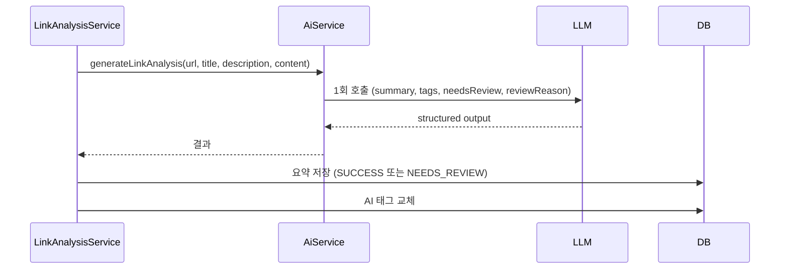

# PR #127: [feat] 링크 요약과 태그를 LLM 1회 호출로 통합하고 개발자 검토 상태 추가

- URL: https://github.com/mash-up-kr/Promise.9-Server/pull/127
- Author: @Choi-JY1107
- Base: main
- Head: feat/link-analysis-single-call
- Merged: 2026-09-09T12:23:11Z

## PR Body

## 📌 개요
링크 요약과 태그를 LLM 1회 호출로 함께 생성하도록 통합했습니다. AI가 이상하다고 판단한 링크는 기존 `ai_summary_status` 컬럼에 `NEEDS_REVIEW`로 남겨 개발자만 확인할 수 있게 했습니다.

## ✅ 작업 내용 및 변경 사항
- [x] 요약, 태그, 검토 판정을 하나의 structured output 스키마로 통합 (`generateLinkAnalysis`)
- [x] `ai_metrics.task_type`을 `LINK_ANALYSIS_GENERATE`로 통일
- [x] 검토 대상 링크는 `NEEDS_REVIEW`로 저장하고 warn 로그 기록
- [x] 클라이언트 응답의 `processingStatus`는 `NEEDS_REVIEW`를 `SUCCESS`로 변환
- [x] 관련 문서와 다이어그램 추가 (`docs/ai/link-analysis-single-call.md`)

## 💬 리뷰어에게
- LLM 호출이 링크당 2회에서 1회로 줄었습니다. 대신 호출 실패 시 요약과 태그가 함께 실패합니다.
- `needsReview` 판정 기준(로그인 페이지, URL 불일치, 유해 또는 스팸 의심, 내용 부족)이 적절한지 봐주세요.
- 클라이언트 응답 형식은 바뀌지 않았습니다.

## 🔗 관련 이슈
close #

## 🔍 상세 내용

검토 사유는 `ai_metrics.generated_result.reviewReason`에서 조회합니다. 재시도 규칙과 SQS 메시지 형식은 변경하지 않았습니다.
