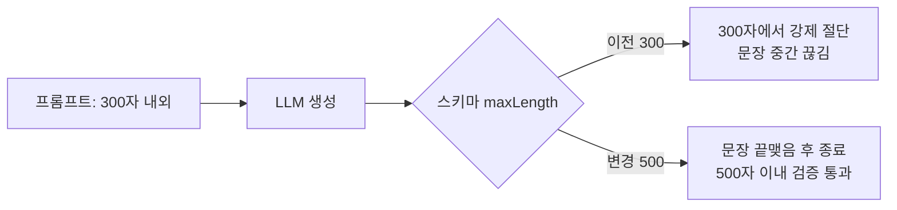

# PR #135: [fix] AI 요약이 300자에서 문장 중간에 잘리는 문제 수정

- URL: https://github.com/mash-up-kr/Promise.9-Server/pull/135
- Author: @Choi-JY1107
- Base: main
- Head: fix/ai-summary-truncation
- Merged: 2026-09-10T07:03:40Z

## PR Body

## 📌 개요
AI 요약 스키마의 `maxLength: 300`이 OpenAI strict 모드의 제한 디코딩으로 전달되어, 300자에 닿으면 문장 중간에서 강제로 잘리는 문제를 수정했습니다.
스키마 상한을 500자로 늘려 모델이 문장을 끝맺을 여유를 두고, 이미 잘린 운영 요약을 다시 생성하는 백필 스크립트를 추가했습니다.

## ✅ 작업 내용 및 변경 사항
- [x] 요약 스키마 상한을 500자로 분리 (`summaryTargetLength: 300`, `summaryMaxLength: 500`)
- [x] 프롬프트의 목표 길이(300자 내외)를 상수로 참조
- [x] 잘린 요약 재생성 스크립트 `db:backfill:summaries` 추가
- [x] bun test에서 실패하던 `advanceTimersByTimeAsync` spec 2개 수정 (커밋 훅 복구)
- [x] 관련 문서 갱신

## 💬 리뷰어에게
- 프롬프트 문구는 그대로 "300자 내외"이고 검증 상한만 500자로 늘렸습니다. 300자를 조금 넘겨도 완결된 문장으로 저장됩니다.
- 운영 DB에서 잘린 요약은 108건(요약 전체의 약 10%)이며, 백필은 머지 후 터널을 열고 `--allow-production`으로 실행합니다.

## 🔗 관련 이슈
close #

## 🔍 상세 내용

- 검증: gpt-5.4-mini로 10회 호출 시 300자 초과 2건 포함 모두 문장 종결, 500자 초과 0건.
- 백필 기준: 삭제되지 않은 링크 중 요약이 299자 이상이면서 문장 부호로 끝나지 않는 것. 요약과 임베딩만 재생성하고 태그는 유지하며, 실패 시 기존 요약과 상태를 되돌립니다.
