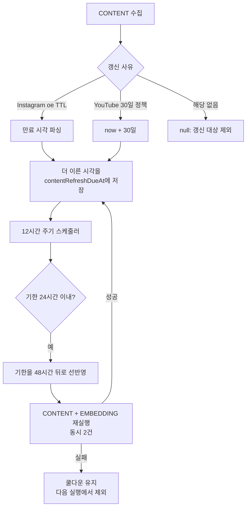

# PR #136: [feature] 인스타 썸네일 TTL·YouTube 30일 정책 만료 전 링크 콘텐츠 자동 갱신

- URL: https://github.com/mash-up-kr/Promise.9-Server/pull/136
- Author: @hyoinkang
- Base: main
- Head: feature/thumbnail-ttl-refresh
- Merged: 2026-09-11T13:08:04Z

## PR Body

## 📌 개요
Instagram 썸네일은 CDN 서명 URL의 `oe` 파라미터에 약 4.4일짜리 TTL이 있어 만료되면 이미지가 깨지고, YouTube는 개발자 정책상 저장한 API 데이터를 30일마다 갱신해야 합니다. 두 만료 사유 중 더 이른 시각을 `links.contentRefreshDueAt` 한 컬럼에 담고, 12시간 주기 스케줄러가 만료 24시간 전에 CONTENT와 EMBEDDING을 다시 실행해 미리 갱신합니다.

## ✅ 작업 내용 및 변경 사항
- [x] `links.contentRefreshDueAt` 컬럼과 조회용 부분 인덱스 추가
- [x] Instagram CDN URL의 `oe`(16진수 UNIX 초)를 파싱해 `metadata.images[].expiresAt`에 저장
- [x] 썸네일 TTL과 YouTube 30일 정책 중 더 이른 시각을 갱신 기한으로 선택 (`pickContentRefreshDueAt`)
- [x] 12시간 주기 `LinkContentRefreshScheduler` 추가 — 기한 24시간 전 링크를 재수집
- [x] 재실행 전 기한을 쿨다운(48시간)만큼 선반영해 수집 실패 링크의 기한 고착 방지
- [x] 재수집을 2건씩 나눠 실행해 외부 스크래핑 API 동시 호출 제한
- [x] `metadata.images` 보관 개수를 5개로 제한
- [x] 기존 링크 기한 백필 스크립트 `db:backfill:content-refresh` 추가

리뷰 반영

- [x] 삭제·비공개된 YouTube 영상과 비워진 설명을 저장값 삭제로 반영 (30일 정책)
- [x] 갱신으로 제목이 바뀌면 EMBEDDING도 재실행해 벡터가 옛 제목에 묶이지 않게 함
- [x] `expiresAt`이 없는 기존 Instagram 행은 이미지 URL의 `oe`에서 만료 시각 폴백 계산
- [x] 영상 ID를 뽑을 수 있는 YouTube URL에만 30일 정책 기한 적용 (채널·재생목록 제외)
- [x] 백필 기준 시각을 `updated_at` → `created_at`으로 변경 (메모 수정 등에 밀리지 않도록)
- [x] TinyFish 분당 호출 상한(135/150)을 클라이언트에서 차단

## 💬 리뷰어에게
- 머지 이후에 유튜브 링크 수집 기한을 알기 위해 스크립트 한 번 실행해야 합니당
- 늦어서 죄송합니당,,, ㅎㅎ

## 🔗 관련 이슈
close #

## 🔍 상세 내용

### 기한 고착 방지

재수집을 수행 전 기한을 먼저 미뤄둡니다. 조회가 `contentRefreshDueAt` 오름차순 + 500건 상한이라, 삭제된 게시물이나 수집 실패 링크의 기한이 과거로 남으면 매 실행마다 앞줄을 독차지해 정상 링크가 갱신되지 않습니다. 같은 이유로 `pickContentRefreshDueAt`은 이미 지난 시각을 반환하지 않고 쿨다운 뒤로 보냅니다.

### 검증

로컬 DB(pgvector 컨테이너)와 실제 외부 API로 전 구간을 확인했습니다.

| 경로 | 시나리오 | 결과 |
| --- | --- | --- |
| Instagram | 만료된 썸네일(`oe` 2026-01-01) 저장 → 스케줄러 실행 | 새 URL `oe` 만료 4.34일 뒤로 갱신 |
| Instagram | 대조군 — 갱신 전후 URL 실제 요청 | 옛 URL `HTTP 403` → 새 URL `HTTP 206 image/jpeg` |
| YouTube | 31일 전 수집된 링크 → 스케줄러 실행 | 다음 기한 정확히 30.000일 뒤, 썸네일 `HTTP 206` |
| YouTube | 썸네일 TTL 확인 | 쿼리 파라미터 없음 → `expiresAt` 미저장 (정책 사유만 적용) |
| 스케줄러 | 수집 실패 시뮬레이션 | 기한이 과거에 머물지 않고 쿨다운 48시간 적용, 12시간 뒤 재실행에서 제외 |
| 백필 | `expiresAt` 없는 기존 Instagram 행 | URL `oe`에서 기한 계산 (수정 전에는 `null`로 누락) |
| 백필 | 6개월 전 저장된 YouTube 링크 | 150일 초과한 기한 → 즉시 갱신 대상 |
| 백필 | 채널 링크 · TTL 없는 일반 링크 | 기한 미부여 (`null` 유지) |

### 참고

YouTube 30일 주기는 [Developer Policies](https://developers.google.com/youtube/terms/developer-policies)의 "After 30 calendar days, the API Client must either delete or refresh the stored data" 요구사항을 따릅니다.
