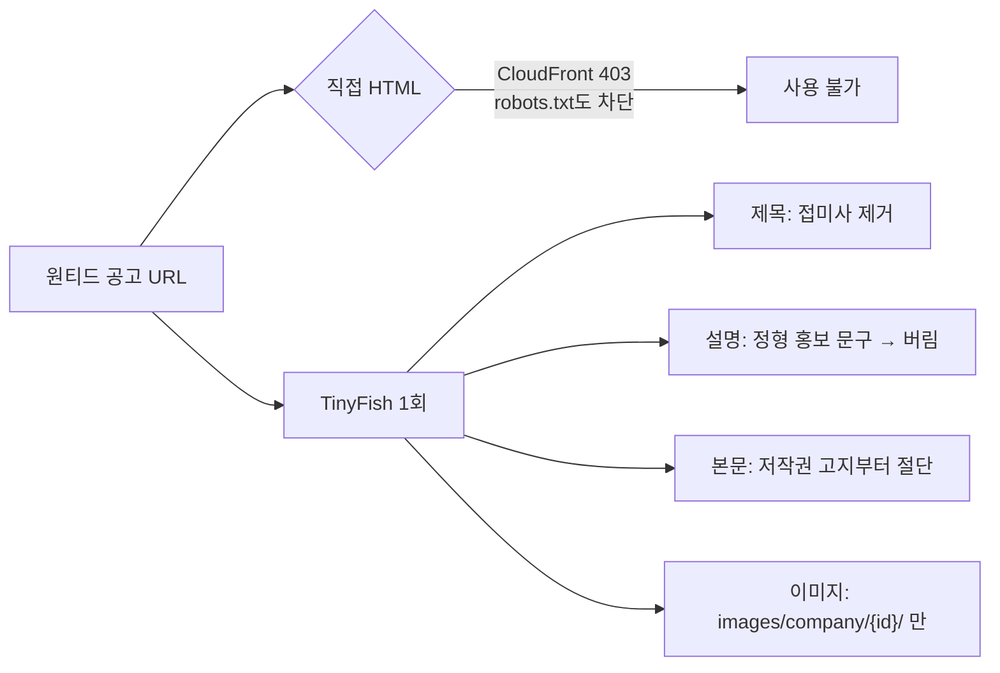

# PR #140: [feature] 원티드 채용 공고 링크 콘텐츠 수집 지원

- URL: https://github.com/mash-up-kr/Promise.9-Server/pull/140
- Author: @hyoinkang
- Base: main
- Head: feat/wanted-link-content-strategy
- Merged: 2026-09-12T02:20:02Z

## PR Body

## 📌 개요
원티드는 직접 HTTP 요청이 CloudFront에서 403으로 차단돼 robots.txt조차 읽을 수 없어, 기본 OG 전략으로는 아무것도 얻을 수 없습니다.

기존 TinyFish 경로에 `wanted` 전략을 추가해 공개 공고를 요청 1회로 수집합니다. 제목의 사이트명 접미사와 본문 끝 저작권·추천 블록을 정리하고, 정보가 없는 정형 홍보 문구 메타 설명은 사용하지 않습니다.

## ✅ 작업 내용 및 변경 사항
- [x] `wanted` TinyFish 전략 추가 — 공개 공고 `/wd/{id}`만 지원
- [x] `country_code` 등 추적 쿼리를 제거하고 canonical `www.wanted.co.kr/wd/{id}`로 요청
- [x] 제목에서 ` | 원티드` 접미사 제거
- [x] 정형 홍보 문구인 메타 설명을 저장·AI 입력에서 제외
- [x] 본문 끝 원티드랩 저작권 고지와 추천 포지션 블록 절단
- [x] 대표 이미지를 `images/company/{회사 ID}/` 자산으로 한정 (기본 대체 이미지·SNS 아이콘 제외)
- [x] Registry 등록과 전략·서비스·레지스트리 테스트 추가
- [x] 콘텐츠 README에 지원 경로·선택 기준·미지원 케이스 정리

## 💬 리뷰어에게
- **메타 설명을 버린 것**이 이번 PR의 유일한 판단입니다. 표본 4건 모두 `{회사}의 {포지션} 포지션을 확인해 보세요. 취업·이직에 성공하면, 합격보상금 50만원을 드립니다.` 형태로 회사·포지션만 갈아끼운 문구였습니다. 제목이 이미 그 둘을 담고 있어 정보가 0이고, AI 요약과 검색에 "합격보상금 50만원"이 섞이는 쪽이 손해라고 봤습니다. 설명을 남기는 편이 낫다고 보시면 말씀해주세요.
- 본문의 `## 근무지역`은 공고 정보로 보고 남겼습니다. 잘라내는 기준점은 그 뒤의 저작권 고지입니다.
- 검증 중 TinyFish 429를 만났는데, 응답 헤더가 `x-ratelimit-limit: 150`, `retry-after: 60`이었습니다. 원티드 수집 문제가 아니라 검증 트래픽이 계정 분당 한도를 소진한 것이고, 창이 리셋되면 정상 동작합니다. 다만 PR #136에서 넣은 분당 제한기가 **프로세스 메모리 카운터**라 프로세스가 여러 개면 각자 135씩 쓴다는 한계가 그대로 드러났습니다. 공유 카운터(Redis·DB)와 `retry-after` 준수는 별도 이슈로 제안드립니다.

## 🔗 관련 이슈
close #

## 🔍 상세 내용

### 수집 경로 선택

직접 HTTP는 브라우저 User-Agent를 붙여도 `403 Request blocked`가 돌아옵니다. robots.txt를 읽을 수 없어 직접 수집 경로 자체가 성립하지 않습니다.

### 이미지 선택 기준

TinyFish가 돌려주는 이미지에는 공고 이미지 외에 기본 대체 이미지와 SNS 아이콘이 섞여 있어 경로로 구분합니다.

| 경로 | 예시 크기 | 사용 |
| --- | --- | --- |
| `images/company/{회사 ID}/…__1080_790.jpg` | `w=700` | ✅ 공고 이미지 |
| `images/proposal/company-default.png` | `w=80` | ❌ 기본 대체 |
| `images/brand_new/{instagram,facebook,…}.png` | `w=20` | ❌ SNS 아이콘 |

### 검증

실제 공고 3건으로 `preview`·`collect`를 재검증했습니다. 각각 TinyFish 요청 1회입니다.

| 공고 | 제목 | 본문 | 이미지 |
| --- | --- | --- | --- |
| `/wd/202585` | `[위시켓] 백엔드 개발 채용 공고` | 3,448자 | `HTTP 206 image/webp` |
| `/wd/39710` | `[라인게임즈] 웹 백엔드 개발자 채용 공고` | 471자 (푸터 절단) | `HTTP 206 image/webp` |
| `/wd/161651` | `[해리] 백엔드 개발자 (3년 이상) 채용 공고` | 2,067자 | `HTTP 206 image/webp` |

- 세 건 모두 설명이 `null`로 제거되고 본문만 남는 것을 확인했습니다.
- `?country_code=WW` 유무가 같은 응답을 주는 것을 확인한 뒤 쿼리를 제거했습니다.
- `collect` 소요는 성공 기준 중앙값 약 2.2초(범위 1.4~2.4초)입니다. 캐시 허용(`ttl: 3600`) 설정에서 측정했고 캐시 적중 여부는 확인하지 않았습니다.

### 남은 한계

- TinyFish key가 없으면 수집할 수 없습니다. 직접 HTML이 차단돼 다른 사이트와 달리 폴백 경로가 없습니다.
- 회사 이미지가 없는 공고는 `null`을 반환합니다. 단위 테스트로만 확인했고 해당하는 실제 공고는 찾지 못했습니다.
- 마감·삭제된 공고 화면은 확인하지 못했습니다.
- 본문 절단은 저작권 고지 문구에 의존합니다. 문구가 바뀌면 절단되지 않고 푸터가 남습니다(수집 자체는 실패하지 않습니다).
